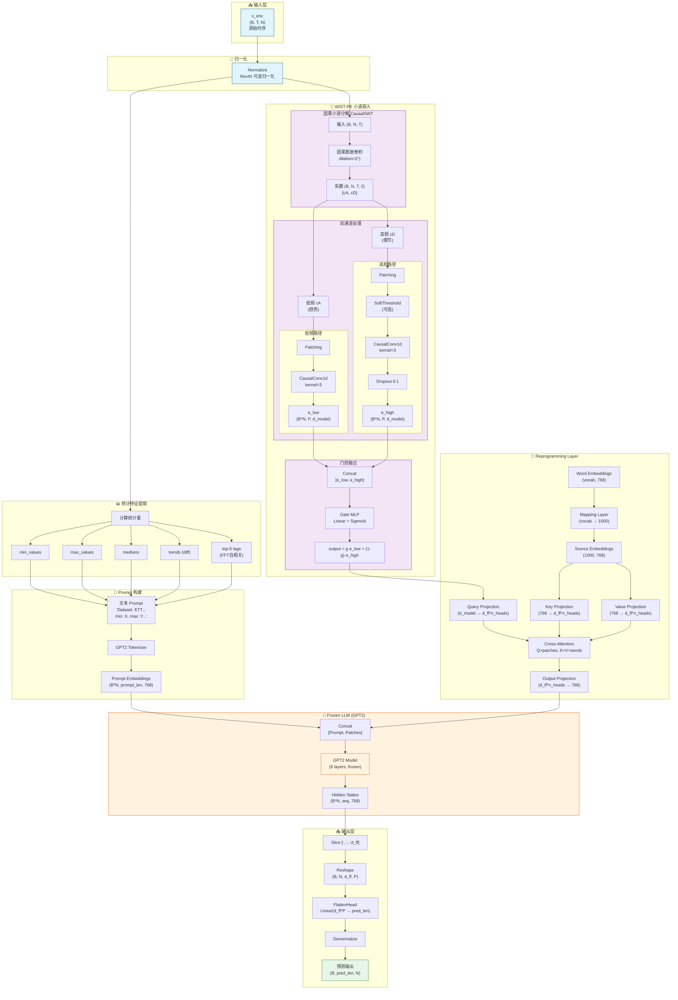
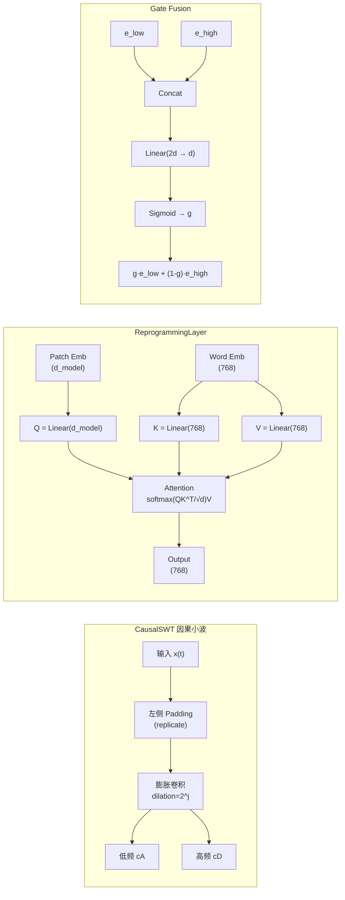
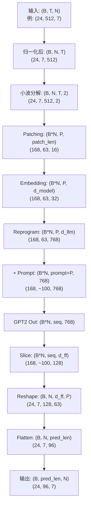

我先读取关键文件来分析当前架构。

基于对代码的完整分析，我为你绘制了当前 **TimeLLM + WIST-PE** 架构的 Mermaid 图。

---

## 当前架构分析

### 整体数据流

---

### 核心模块详解

---

### 维度变化流程

---

### 关键设计总结

| 模块 | 作用 | 关键参数 |
|------|------|----------|
| **CausalSWT** | 全局因果小波分解，分离趋势与细节 | `wavelet_type`, `level` |
| **双通道投影** | 低频直投，高频去噪+Dropout | `hf_dropout`, `use_soft_threshold` |
| **门控融合** | 自适应加权低频/高频 | `gate_bias_init` |
| **ReprogrammingLayer** | 将时序特征"翻译"为LLM可理解的语义 | `d_model`, `n_heads` |
| **Frozen GPT2** | 利用预训练语言模型的推理能力 | `llm_layers` |