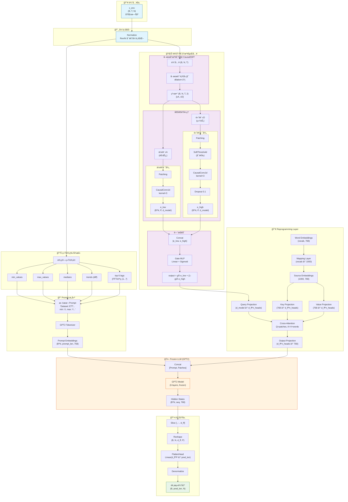
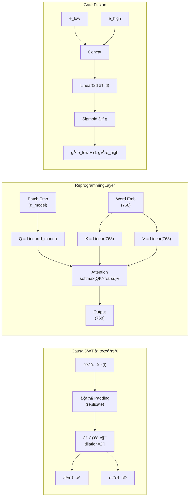
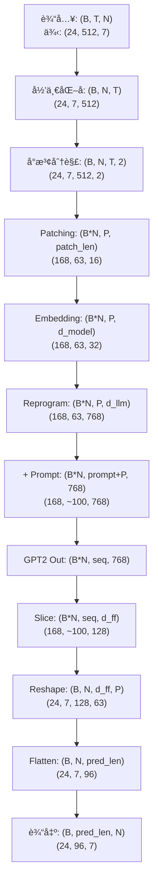

我先读å–关键文件æ¥åˆ†æ当å‰æ¶æ„。

基äºå¯¹ä»£ç çš„完整分æï¼Œæˆ‘ä¸ºä½ ç»˜åˆ¶äº†å½“å‰ **TimeLLM + WIST-PE** æ¶æ„çš„ Mermaid 图。

---

## 当å‰æ¶æ„分æ

### 整体数æ®æµ

---

### 核心模å—详解

---

### 维度å˜åŒ–æµç¨‹

---

### 关键设计总结

| æ¨¡å— | 作用 | 关键å‚æ•° |
|------|------|----------|
| **CausalSWT** | 全局因æœå°æ³¢åˆ†è§£ï¼Œåˆ†ç¦»è¶‹åŠ¿ä¸ç»†èŠ‚ | `wavelet_type`, `level` |
| **åŒé€šé“投影** | ä½é¢‘直投，高频å»å™ª+Dropout | `hf_dropout`, `use_soft_threshold` |
| **é—¨æ§èåˆ** | 自适应加æƒä½é¢‘/高频 | `gate_bias_init` |
| **ReprogrammingLayer** | 将时åºç‰¹å¾"翻译"为LLMå¯ç†è§£çš„语义 | `d_model`, `n_heads` |
| **Frozen GPT2** | 利用预训练语言模å‹çš„æ¨ç†èƒ½åŠ› | `llm_layers` |