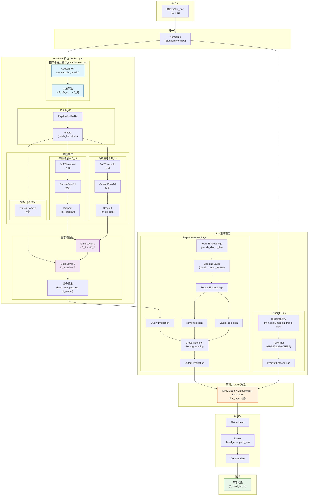

根据我对代码的分析，以下是 TimeLLM + WIST-PE 的完整架构图：

---

## 架构说明

### 1. **WIST-PE 模块** ([layers/Embed.py](cci:7://file:///home/dmx_MT/LZF/project/CAST/layers/Embed.py:0:0-0:0))
核心创新模块，包含：
- **CausalSWT** ([layers/CausalWavelet.py](cci:7://file:///home/dmx_MT/LZF/project/CAST/layers/CausalWavelet.py:0:0-0:0)): 因果平稳小波变换，支持 db1~db5 小波基
- **多频段处理**: 每个频段独立投影 + 去噪 + Dropout
- **金字塔融合**: 从高频到低频逐级门控融合

### 2. **ReprogrammingLayer** ([models/TimeLLM.py](cci:7://file:///home/dmx_MT/LZF/project/CAST/models/TimeLLM.py:0:0-0:0))
将时序 Patch Embedding 重编程为 LLM 可理解的表示：
- Query: 来自 WIST-PE 的 Patch Embedding
- Key/Value: 来自 LLM 词表的 Source Embedding
- 通过 Cross-Attention 实现时序→语言的跨模态对齐

### 3. **预训练 LLM** (冻结)
支持 GPT2 / LLAMA / BERT，参数冻结，仅作为特征提取器

### 4. **FlattenHead** ([models/TimeLLM.py](cci:7://file:///home/dmx_MT/LZF/project/CAST/models/TimeLLM.py:0:0-0:0))
将 LLM 输出展平并投影到预测长度