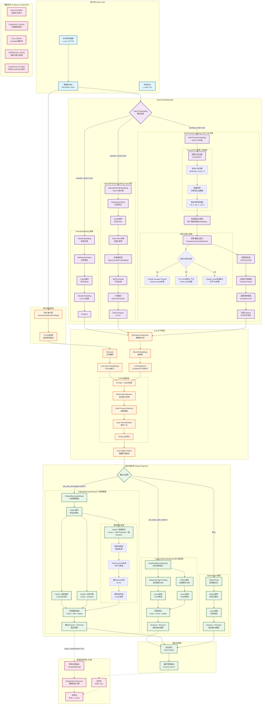

我需要分析这些文件来生成详细的模型架构图。让我先创建一个任务计划，然后逐个读取这些文件来理解模型架构。

让我开始读取这些文件来理解模型架构。

让我继续读取其他层文件来理解完整的模型架构。

让我继续读取剩余的文件来完成模型架构的分析。

现在我已经读取了所有相关文件，让我更新任务状态并开始分析模型架构。

基于对所有文件的分析，我现在来生成详细的模型架构图。让我先完成数据流分析，然后生成 Mermaid 架构图。

基于对所有文件的深入分析，我现在生成详细的 CAST 模型架构图。这个模型是一个基于 TimeLLM 的时间序列预测模型，集成了多种先进的组件。

## CAST 模型详细架构图

基于对所有文件的深入分析，我已经生成了完整的 CAST 模型架构图。这是一个基于 TimeLLM 的先进时间序列预测模型，集成了多种创新组件：

### 🏗️ **模型整体架构**

### 📋 **核心组件说明**

#### **1. 输入处理层**
- **数据标准化**: 使用 [Normalize](cci:2://file:///home/dmx_MT/LZF/project/CAST/layers/StandardNorm.py:4:0-67:16) 层进行 RevIN 标准化
- **统计特征提取**: 计算 min/max/median/trend/lags 等统计量
- **Prompt 构建**: 将统计信息转换为自然语言描述

#### **2. Patch Embedding 层（三种方案）**

**🔹 原版 PatchEmbedding**
- 标准的时间序列分块嵌入
- ReplicationPad1d → Unfold → TokenEmbedding → Dropout

**🔹 WaveletPatchEmbedding (Haar方案)**
- Haar 小波分解每个 Patch
- 双通道独立投影（低频+高频）
- 门控融合机制，偏向低频趋势
- 高频通道强 Dropout (p=0.5) 防过拟合

**🔹 WISTPatchEmbedding (WIST-PE方案)**
- **因果小波变换**: 使用 [CausalSWT](cci:2://file:///home/dmx_MT/LZF/project/CAST/layers/CausalWavelet.py:106:0-245:21) 进行全局多级分解
- **多频段处理**: 每个频段独立嵌入投影
- **频率通道注意力**: 三个版本可选
  - V1: Global Average Pooling (Instance-wise)
  - V2: 1D Conv 局部上下文 (Patch-wise)  
  - V3: Global-Local 双流融合
- **分层金字塔融合**: 多级分解的层次化融合
- **因果卷积增强**: 保持时序因果性

#### **3. LLM 主干网络**
- **跨模态对齐**: [ReprogrammingLayer](cci:2://file:///home/dmx_MT/LZF/project/CAST/models/TimeLLM.py:367:0-405:38) 将时序特征对齐到 LLM 空间
- **LLM 选择**: 支持 LLAMA/GPT2/BERT 三种预训练模型
- **Prompt 融合**: 自然语言描述与时序嵌入拼接
- **冻结参数**: LLM 参数冻结，仅训练对齐层和输出头

#### **4. 输出投影层（三种方案）**

**🔹 FlattenHead (原版)**
- 简单的 Flatten + Linear 投影

**🔹 DualScaleResidualHead (双尺度残差)**
- **全局趋势分支**: GAP → Linear (捕获整体水位)
- **局部细节分支**: Flatten → Linear (捕获时序波动)
- **残差融合**: Trend + Detail，利用残差学习

**🔹 TriBandDecoupledHead (三频带解耦)**
- **低频头**: 无正则化，学习主要趋势
- **中频头**: 轻度 Dropout，学习周期性模式
- **高频头**: SoftThreshold + 强 Dropout，学习细节波动
- **时域重构**: 三个分量直接相加
- **深度监督**: 可选的频率分量辅助损失

#### **5. 辅助组件**
- **AutoCorrelation**: 自相关注意力机制
- **Autoformer_EncDec**: 序列分解架构组件
- **Conv_Blocks**: Inception 卷积块
- **SelfAttention_Family**: 多种注意力机制 (Full/Prob/DS/Reformer)
- **Transformer_EncDec**: 标准 Transformer 编解码器

### 🎯 **模型创新点**

1. **WIST-PE 因果小波嵌入**: 全局多级小波分解 + 因果性保证
2. **频率通道注意力**: 动态频率权重分配，自适应频域融合
3. **三频带解耦输出**: 显式建模低/中/高频分量，提升预测精度
4. **深度监督训练**: 使用小波分解的 Ground Truth 指导训练
5. **跨模态对齐**: 时序特征与 LLM 语义空间的有效对齐

这个架构图完整展现了 CAST 模型的复杂性和先进性，特别是在小波变换、频率解耦和因果性保证方面的创新设计。