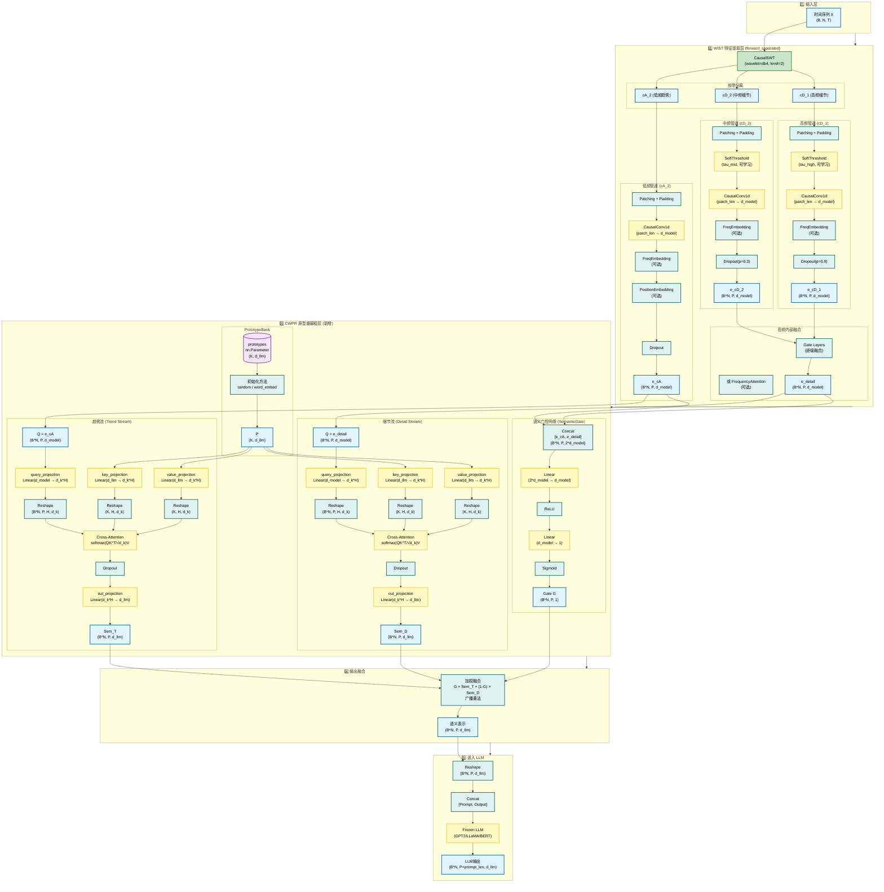

# CWPR 实现详细架构图

## 完整数据流架构



## 关键维度说明

### 维度变化流程

```
输入: (B, N, T)
  ↓ CausalSWT
频带: (B, N, T, level+1)  # level=2时: [cA_2, cD_2, cD_1]
  ↓ Patching + Projection
WIST输出: 
  - e_cA: (B*N, P, d_model)
  - e_detail: (B*N, P, d_model)
  ↓ CWPR Cross-Attention
语义空间:
  - Sem_T: (B*N, P, d_llm)
  - Sem_D: (B*N, P, d_llm)
  ↓ 门控融合
最终输出: (B*N, P, d_llm)
```

### 参数说明

- **B**: Batch size
- **N**: 变量数 (number of variables)
- **T**: 时间序列长度
- **P**: Patch数量 (num_patches)
- **d_model**: WIST输出维度 (默认16或32)
- **d_llm**: LLM嵌入维度 (GPT2:768, LLaMA:4096, BERT:768)
- **K**: 原型库大小 (默认256)
- **H**: 注意力头数 (默认8)
- **d_k**: 每个头的键维度 (d_ff // H)

## 模块详细说明

### 1. WIST 层 (forward_separated)

**双通道模式 (level=1)**:
- 直接分离低频和高频
- 高频经过软阈值去噪和Dropout

**金字塔融合模式 (level>=2)**:
- 每个频段独立处理（独立去噪、独立Dropout）
- 高频部分（cD_n, ..., cD_1）融合成 e_detail
- 低频（cA_n）直接作为 e_cA

### 2. CWPR 模块组件

**PrototypeBank**:
- 可学习参数: `nn.Parameter(K, d_llm)`
- 初始化: random (N(0, 0.02)) 或 word_embed (从词嵌入采样)

**CWPRCrossAttention**:
- Query投影: `d_model → d_k * H`
- Key/Value投影: `d_llm → d_k * H`
- 注意力计算: `softmax(QK^T / √d_k) V`
- 输出投影: `d_k * H → d_llm`

**SemanticGate**:
- 输入: `[e_cA, e_detail]` → `(B*N, P, 2*d_model)`
- MLP: `2*d_model → d_model → 1`
- 输出: `(B*N, P, 1)` 标量门控权重

### 3. 融合机制

```python
output = gate * Sem_T + (1 - gate) * Sem_D
```

- `gate` 值接近1: 偏向趋势流
- `gate` 值接近0: 偏向细节流
- 初始偏置 `gate_bias_init=2.0` 使 `sigmoid(2.0)≈0.88`，初始偏向趋势

