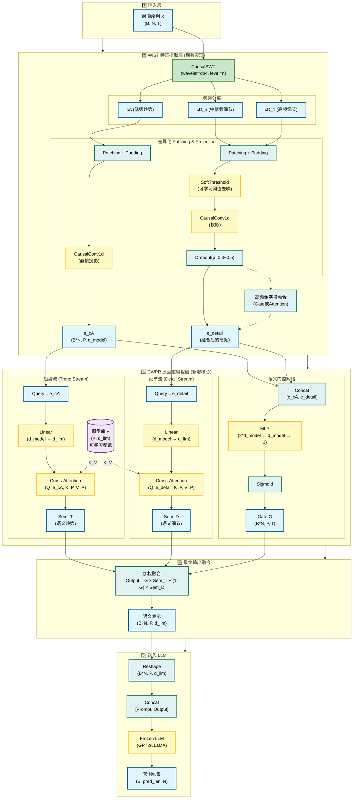
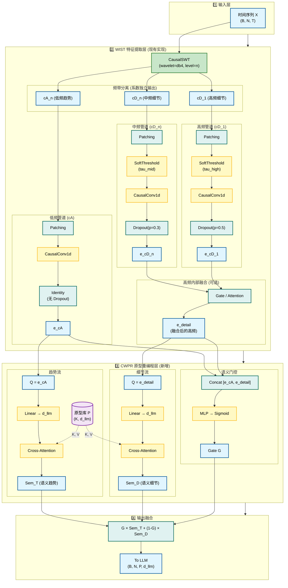
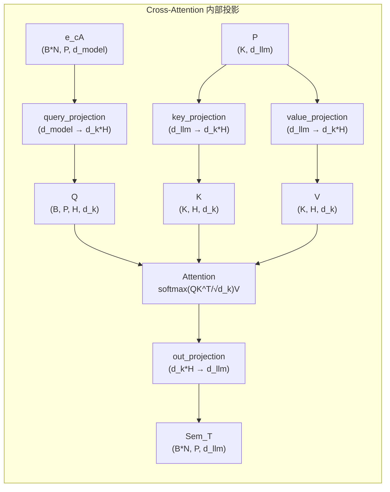
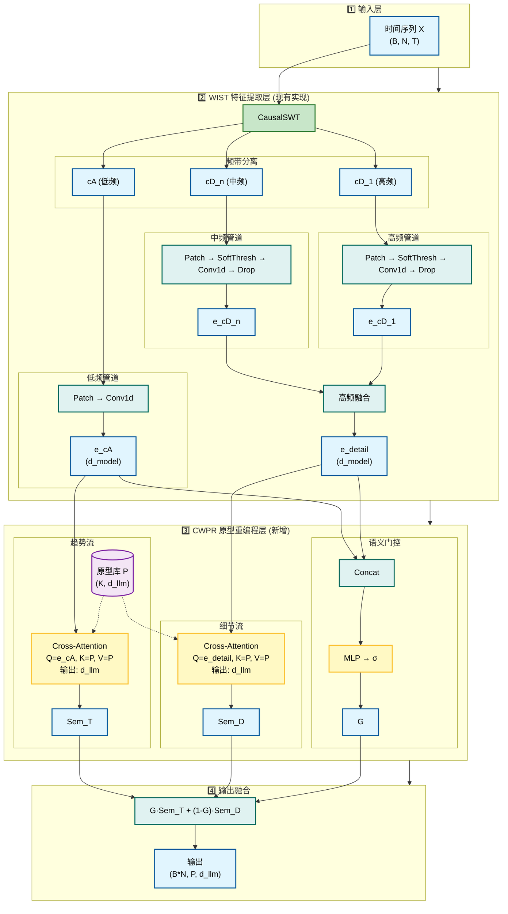
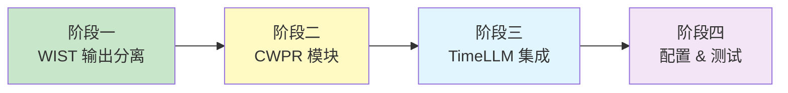
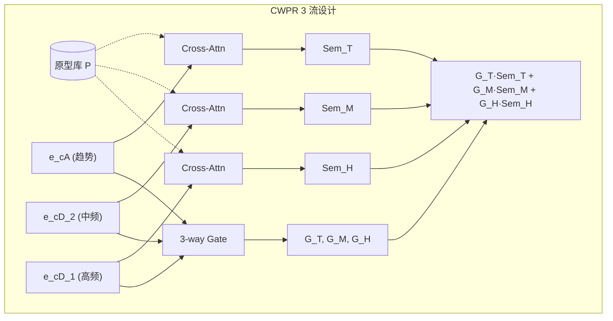
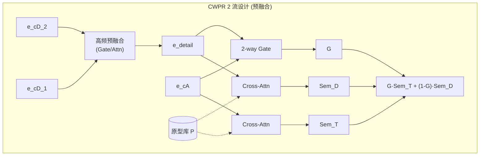
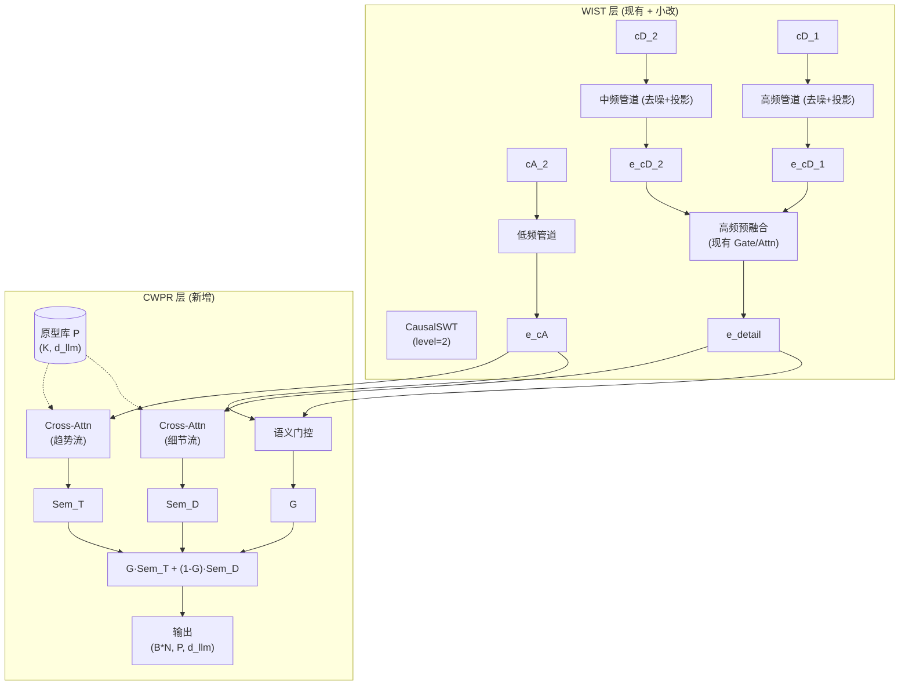

# Chat Conversation

Note: _This is purely the output of the chat conversation and does not contain any raw data, codebase snippets, etc. used to generate the output._

### User Input

graph TB
    %% 样式定义
    classDef tensor fill:#e1f5fe,stroke:#01579b,stroke-width:2px,color:#000;
    classDef module fill:#fff9c4,stroke:#fbc02d,stroke-width:2px,color:#000;
    classDef param fill:#f3e5f5,stroke:#7b1fa2,stroke-width:2px,color:#000;
    classDef op fill:#e0f2f1,stroke:#00695c,stroke-width:2px,color:#000;

    subgraph Input ["输入层"]
        X["时间序列 X (B, N, T)"]:::tensor
    end

    %% ================= 1. WIST 特征提取层 (保留你的实现) =================
    subgraph WIST_Extraction ["Step 1: WIST 特征提取 (你的实现)"]
        direction TB
        
        SWT["CausalSWT (Global)"]:::module
        X --> SWT
        
        subgraph Bands ["频带分离"]
            LF_Band["低频 cA (Trend)"]:::tensor
            HF_Bands["高频 cD_mid, cD_high (Detail)"]:::tensor
        end
        SWT --> LF_Band
        SWT --> HF_Bands
        
        %% Patching & Projection
        subgraph Projections ["Patching & Embedding"]
            LF_Proj["Patching -> Conv1d -> e_cA"]:::module
            HF_Proj["Patching -> SoftThreshold -> Conv1d -> e_cD_all"]:::module
        end
        LF_Band --> LF_Proj
        HF_Bands --> HF_Proj
        
        %% 高频预融合 (可选，为了简化后续双流)
        HF_PreFuse["高频内部融合 (WIST_GATE_HF)<br/>Merge mid/high -> e_detail"]:::op
        HF_Proj --> HF_PreFuse
    end

    %% ================= 2. CWPR 原型重编程层 (新增/替换部分) =================
    subgraph CWPR_Reprogramming ["Step 2: CWPR 原型重编程 (语义映射)"]
        
        PrototypeBank[("原型库 P (K, d_llm)")]:::param
        
        %% Trend Stream
        subgraph Stream_Trend ["趋势流 (Trend Stream)"]
            Q_Trend["Q = e_cA"]:::tensor
            Attn_Trend["Cross-Attention<br/>(Q=e_cA, K=P, V=P)"]:::module
            Sem_Trend["语义趋势 (Sem_T)"]:::tensor
            
            LF_Proj --> Q_Trend
            Q_Trend --> Attn_Trend
            PrototypeBank -.-> Attn_Trend
            Attn_Trend --> Sem_Trend
        end
        
        %% Detail Stream
        subgraph Stream_Detail ["细节流 (Detail Stream)"]
            Q_Detail["Q = e_detail"]:::tensor
            Attn_Detail["Cross-Attention<br/>(Q=e_detail, K=P, V=P)"]:::module
            Sem_Detail["语义细节 (Sem_D)"]:::tensor
            
            HF_PreFuse --> Q_Detail
            Q_Detail --> Attn_Detail
            PrototypeBank -.-> Attn_Detail
            Attn_Detail --> Sem_Detail
        end
        
        %% 门控网络 (复用你的 WIST 门控思想，但作用于语义层)
        subgraph Semantic_Gating ["语义门控"]
            Concat_Feats["Concat [e_cA, e_detail]"]:::op
            Gate_Net["MLP -> Sigmoid (Gate G)"]:::module
            
            LF_Proj --> Concat_Feats
            HF_PreFuse --> Concat_Feats
            Concat_Feats --> Gate_Net
        end
        
    end

    %% ================= 3. 输出融合 =================
    subgraph Final_Fusion ["Step 3: 最终输出"]
        WeightedSum["Output = G * Sem_T + (1-G) * Sem_D"]:::op
        Final_Out["To LLM (B, N, Patches, d_llm)"]:::tensor
        
        Sem_Trend --> WeightedSum
        Sem_Detail --> WeightedSum
        Gate_Net --> WeightedSum
        WeightedSum --> Final_Out
    end

    %% 连接
    WIST_Extraction --> CWPR_Reprogramming
    CWPR_Reprogramming --> Final_Fusion


@[layers] @[models/TimeLLM.py] 如果实现上面我给出的架构图，请你分析从数据输入层，patching embedding层（使用WIST分解），重编程层的新架构应该是什么样子，给出mermaid图

### Planner Response

我来分析现有代码并理解您提出的架构设计。首先让我查看相关文件。

*Listed directory [layers](file:///d:/Project/github/CAST/layers) *

*Analyzed [TimeLLM.py](file:///d:/Project/github/CAST/models/TimeLLM.py) *

### Planner Response

让我进一步查看关键文件的具体实现：

*Viewed [CausalWavelet.py](file:///d:/Project/github/CAST/layers/CausalWavelet.py) *

*Viewed [Embed.py](file:///d:/Project/github/CAST/layers/Embed.py) *

*Viewed [TimeLLM.py](file:///d:/Project/github/CAST/models/TimeLLM.py) *

### Planner Response

让我继续查看 Embed.py 中的 WISTPatchEmbedding 实现：

*Viewed [Embed.py](file:///d:/Project/github/CAST/layers/Embed.py) *

### Planner Response

现在我已经全面理解了现有代码结构和您提出的架构图。让我为您分析并给出新架构的 **Mermaid 图**。

---

## 📊 新架构分析

根据您提供的架构图，核心改进点如下：

1. **WIST 特征提取层（保留现有实现）**
   - [CausalSWT](cci:2://file:///d:/Project/github/CAST/layers/CausalWavelet.py:106:0-245:21) 全局因果小波分解
   - 频带分离：低频 `cA` + 高频 `cD_mid`, `cD_high`
   - 差异化 Patching & Projection

2. **CWPR 原型重编程层（新增核心模块）**
   - **原型库 P**：可学习的原型向量集 [(K, d_llm)](cci:2://file:///d:/Project/github/CAST/models/TimeLLM.py:31:0-542:19)
   - **趋势流**：`Q=e_cA`, Cross-Attention 映射到语义空间
   - **细节流**：`Q=e_detail`, Cross-Attention 映射到语义空间
   - **语义门控**：基于原始特征 `[e_cA, e_detail]` 计算门控权重

3. **最终输出融合**
   - 门控加权求和：`G * Sem_T + (1-G) * Sem_D`
   - 输出送入 LLM

---

## 🧩 新架构 Mermaid 图



---

## 🔑 与现有架构的对比

| 组件 | 现有实现 | 新架构 (CWPR) |
|------|----------|---------------|
| **Embedding 输出** | 直接门控融合 → `d_model` | 双流 Cross-Attention → `d_llm` |
| **重编程层** | 单一 Cross-Attention (Q=patch, K=V=词表) | 双流 Cross-Attention (Q=频域特征, K=V=原型库) |
| **语义桥** | 依赖词表 Embedding 的隐式映射 | 可学习原型库的显式语义锚点 |
| **频域信息保留** | 融合后丢失显式频域结构 | 趋势/细节分流，语义级独立映射 |
| **门控位置** | Embedding 层内部 (特征级) | 重编程层输出 (语义级) |

---

## 📌 关键设计决策

1. **原型库 P** 的设计：
   - 大小 `K` 推荐 128~512，可作为超参数调优
   - 初始化方式：Word Embedding 的聚类中心 / 随机初始化 + 快速收敛

2. **Query 投影**：
   - 必须将 `d_model` 映射到 `d_llm`（适配 LLM 维度）
   - 推荐使用 `nn.Linear(d_model, d_llm)`

3. **语义门控的输入选择**：
   - 使用原始 Embedding `[e_cA, e_detail]` 而非语义输出
   - 原因：避免 Cross-Attention 的信息瓶颈影响门控判断

这个架构将 **WIST 的频域解耦** 与 **CWPR 的语义映射** 有机结合，实现了从"时序特征空间"到"LLM 语义空间"的显式、可解释的双流桥接。

### User Input

你的中低频和高频是融合在一起然后进行的去噪，我原来的是分开去噪的，请你分析

### Planner Response

您说得对！我仔细分析了您现有的 [WISTPatchEmbedding](cci:2://file:///d:/Project/github/CAST/layers/Embed.py:823:0-1247:44) 代码，确实是**每个频段独立去噪**，而不是融合后去噪。让我更正分析：

---

## 📊 现有实现的准确流程分析

根据 [_forward_pyramid](cci:1://file:///d:/Project/github/CAST/layers/Embed.py:1166:4-1247:44) 方法（第 1167-1248 行）：

```python
for i in range(self.num_bands):
    band = coeffs[:, :, :, i]  # 提取第 i 个频段
    
    # Patching
    patches = band.unfold(...)
    
    # 【独立去噪】对高频频段应用软阈值 (i > 0)
    if i > 0 and self.use_soft_threshold:
        patches = self.band_thresholds[i](patches)  # ← 每个频段单独去噪
    
    # 投影
    e_band = embedding_layer(patches)
    
    # 【独立 Dropout】
    e_band = self.band_dropouts[i](e_band)  # ← 每个频段单独 Dropout
    
    band_embeddings.append(e_band)

# 【最后才融合】
e_fused = freq_attention(band_embeddings)  # 或 gate_layers
```

---

## 🔄 修正后的 Mermaid 架构图



---

## 📌 关键差异对比

| 处理环节 | 错误理解 | 正确实现 |
|---------|---------|---------|
| **去噪位置** | 融合后统一去噪 | **每个高频频段独立去噪** |
| **阈值参数** | 共享一个 threshold | **每个频段独立阈值** `band_thresholds[i]` |
| **Dropout 强度** | 统一 Dropout | **线性插值**：中频 0.3 → 高频 0.5 |
| **低频处理** | 也做去噪 | **低频不做去噪/Dropout** (`Identity`) |
| **融合时机** | 去噪后立即融合 | **投影+Dropout 后才融合** |

---

## 🔑 这样设计的合理性

1. **独立阈值学习**  
   每个频段的噪声特性不同，`cD_1` 包含更多高频噪声，需要更大的阈值过滤

2. **差异化 Dropout**  
   - `cD_1` 最易过拟合 → p=0.5 强正则
   - `cD_n` 相对平稳 → p=0.3 中等正则
   - `cA` 是趋势核心 → 不做 Dropout

3. **保留频域细粒度**  
   独立处理后再融合，可以让后续的门控/注意力机制更精准地感知各频段的信息量

您的原始实现是更合理的设计！我的架构图已修正为准确反映这个"**独立管道 → 后融合**"的结构。

### User Input

微小的优化建议（锦上添花）：
虽然架构图已经接近完美，但我注意到一点细节可以微调，以增强其表达的准确性：

Proj_T 和 Proj_D 的位置：

在图中，Linear -> d_llm 被放在了 Cross-Attention 之前。

实际上： Cross-Attention 的 Query (即 e_cA/e_detail) 的维度通常需要先投影到与 Key (Prototype) 相同的维度 d_llm (或者注意力机制内部的 d_model) 才能进行计算。

确认： 只要你的 e_cA 和 e_detail 在进入 Cross-Attention 之前已经通过 Linear 变换到了合适的维度，目前的画法就是完全正确的。如果 e_cA 还是 Conv1d 输出的维度，那么这里加个 Linear 是必须的。目前的画法逻辑上是通的。

请你客观分析其他ai的建议

### Planner Response

## 🔍 客观分析该建议

这个建议提出了一个**正确的技术观点**，但表述可以更精确。让我逐点分析：

---

### ✅ 建议正确的部分

**核心观点正确**：Cross-Attention 的 Query 和 Key 确实需要在注意力计算维度上对齐。

回顾 Cross-Attention 的数学：
```
Attention(Q, K, V) = softmax(Q @ K^T / √d_k) @ V
```
- `Q @ K^T` 要求 Q 的最后一维 = K 的最后一维（都是 `d_k`）
- 这是必须满足的维度约束

---

### ⚠️ 建议不够精确的部分

**"投影到与 Key (Prototype) 相同的维度 d_llm"** 这个表述不够准确。

参考您现有的 [ReprogrammingLayer](cci:2://file:///d:/Project/github/CAST/models/TimeLLM.py:545:0-583:38) 实现（第 546-584 行）：

```python
def __init__(self, d_model, n_heads, d_keys=None, d_llm=None, ...):
    d_keys = d_keys or (d_model // n_heads)
    
    # Q 来自 d_model，投影到 d_keys * n_heads
    self.query_projection = nn.Linear(d_model, d_keys * n_heads)
    
    # K, V 来自 d_llm，投影到 d_keys * n_heads
    self.key_projection = nn.Linear(d_llm, d_keys * n_heads)
    self.value_projection = nn.Linear(d_llm, d_keys * n_heads)
    
    # 输出从 d_keys * n_heads 投影回 d_llm
    self.out_projection = nn.Linear(d_keys * n_heads, d_llm)
```

**关键点**：
| 维度 | 含义 | 实际值 |
|-----|------|-------|
| `d_model` | WIST Embedding 输出维度 | 32 (configs.d_model) |
| `d_llm` | LLM 嵌入维度 | 768 (GPT2) / 4096 (LLaMA) |
| `d_keys * n_heads` | 注意力计算的内部维度 | d_ff = 128 (典型) |

**正确的理解**：
1. Q 从 `d_model` → `d_keys * n_heads`
2. K, V 从 `d_llm` → `d_keys * n_heads`
3. 输出从 `d_keys * n_heads` → `d_llm`

所以 Q 投影的目标维度是 **`d_keys * n_heads`**（注意力内部维度），不是 `d_llm`。

---

### 📊 修正后的精确架构



---

### 📌 结论

| 评估项 | 判定 |
|-------|-----|
| 建议方向 | ✅ 正确（Q/K 需要维度对齐） |
| 具体描述 | ⚠️ 不够精确（投影目标是 `d_k*H`，不是 `d_llm`） |
| 我原图的画法 | ✅ 逻辑正确（需要投影），但可更精确 |
| 建议的价值 | ✅ 提醒了维度对齐问题，值得在实现时注意 |

**更准确的表述应该是**：  
> `e_cA` (维度 `d_model`) 需要通过 `query_projection` 投影到注意力内部维度 `d_k * n_heads`，与 Key 对齐后做 Attention，最终通过 `out_projection` 输出到 `d_llm`。

这个建议本身是有价值的技术提醒，只是表述可以更精确。感谢您让我客观分析！

### User Input

针对上述分析，设计的架构图需要调整吗

### Planner Response

## 📊 分析结论：需要微调

基于刚才的分析，架构图应该做以下**简化**调整：

---

### 🔧 调整原因

| 问题 | 说明 |
|-----|------|
| `Proj_T`, `Proj_D` 画在外部 | 投影应该是 **Cross-Attention 内部** 的组成部分，不应单独画出 |
| 抽象层次混乱 | 要么画高层架构（黑盒），要么画详细设计（全部展开） |

**参考现有 [ReprogrammingLayer](cci:2://file:///d:/Project/github/CAST/models/TimeLLM.py:545:0-583:38)**：它把 Q/K/V 投影封装在内部，对外只暴露输入输出接口。

---

### ✅ 简化后的架构图



---

### 📋 调整总结

| 调整项 | 之前 | 之后 |
|-------|-----|------|
| `Proj_T`, `Proj_D` | 单独画在外部 | **删除**（内化到 Cross-Attention） |
| Cross-Attention | 只标注名称 | 标注 **输入/输出维度** |
| 整体风格 | 混合层次 | **统一为高层架构图** |

这样架构图更加**简洁清晰**，符合设计文档的表达规范。Cross-Attention 的内部实现细节（Q/K/V 投影）留给代码实现阶段处理。

### User Input

 请你给出现在要实现上述的架构的实现步骤

### Planner Response

## 📋 CWPR 架构实现步骤

根据最终确定的架构，以下是分阶段的实现步骤：

---

### 🔧 阶段一：修改 WIST 层输出

**目标**：让 [WISTPatchEmbedding](cci:2://file:///d:/Project/github/CAST/layers/Embed.py:823:0-1247:44) 同时输出 `e_cA` 和 `e_detail`（目前只输出融合后的结果）

| 步骤 | 任务 | 文件 |
|-----|------|-----|
| 1.1 | 修改 [_forward_pyramid](cci:1://file:///d:/Project/github/CAST/layers/Embed.py:1166:4-1247:44) 方法，返回 [(e_cA, e_detail, n_vars)](cci:2://file:///d:/Project/github/CAST/models/TimeLLM.py:31:0-542:19) 三元组 | [layers/Embed.py](cci:7://file:///d:/Project/github/CAST/layers/Embed.py:0:0-0:0) |
| 1.2 | 新增 `forward_for_cwpr()` 方法，专门为 CWPR 提供分离输出 | [layers/Embed.py](cci:7://file:///d:/Project/github/CAST/layers/Embed.py:0:0-0:0) |
| 1.3 | 保持原有 [forward()](cci:1://file:///d:/Project/github/CAST/layers/Embed.py:770:4-772:30) 兼容性，内部调用新方法后融合 | [layers/Embed.py](cci:7://file:///d:/Project/github/CAST/layers/Embed.py:0:0-0:0) |

**输出变化**：
```
原：(e_fused, n_vars)  →  形状 (B*N, P, d_model)
新：(e_cA, e_detail, n_vars)  →  两个 (B*N, P, d_model)
```

---

### 🔧 阶段二：实现 CWPR 模块

**目标**：创建 `CWPRReprogrammingLayer` 类

| 步骤 | 任务 | 说明 |
|-----|------|------|
| 2.1 | 创建新文件 `layers/CWPR.py` | 存放 CWPR 相关模块 |
| 2.2 | 实现 `PrototypeBank` 类 | 可学习原型库 [(K, d_llm)](cci:2://file:///d:/Project/github/CAST/models/TimeLLM.py:31:0-542:19) |
| 2.3 | 实现 `DualStreamCrossAttention` 类 | 双流 Cross-Attention (趋势流 + 细节流) |
| 2.4 | 实现 `SemanticGate` 类 | 语义门控网络 |
| 2.5 | 实现 `CWPRReprogrammingLayer` 类 | 组合上述组件的主模块 |

**模块接口设计**：
```
CWPRReprogrammingLayer:
  输入: e_cA (B*N, P, d_model), e_detail (B*N, P, d_model)
  输出: semantic_out (B*N, P, d_llm)
```

---

### 🔧 阶段三：集成到 TimeLLM

**目标**：在 [Model](cci:2://file:///d:/Project/github/CAST/models/TimeLLM.py:31:0-542:19) 类中替换原有 [ReprogrammingLayer](cci:2://file:///d:/Project/github/CAST/models/TimeLLM.py:545:0-583:38)

| 步骤 | 任务 | 文件 |
|-----|------|-----|
| 3.1 | 新增配置参数 `use_cwpr` | [models/TimeLLM.py](cci:7://file:///d:/Project/github/CAST/models/TimeLLM.py:0:0-0:0) |
| 3.2 | 条件初始化：CWPR vs 原版 ReprogrammingLayer | [models/TimeLLM.py](cci:7://file:///d:/Project/github/CAST/models/TimeLLM.py:0:0-0:0) |
| 3.3 | 修改 [forecast()](cci:1://file:///d:/Project/github/CAST/models/TimeLLM.py:294:4-398:26) 方法，根据模式调用不同逻辑 | [models/TimeLLM.py](cci:7://file:///d:/Project/github/CAST/models/TimeLLM.py:0:0-0:0) |
| 3.4 | 确保与现有 [FlattenHead](cci:2://file:///d:/Project/github/CAST/models/TimeLLM.py:16:0-28:16) / `TriBandDecoupledHead` 兼容 | [models/TimeLLM.py](cci:7://file:///d:/Project/github/CAST/models/TimeLLM.py:0:0-0:0) |

---

### 🔧 阶段四：配置与训练支持

| 步骤 | 任务 | 文件 |
|-----|------|-----|
| 4.1 | 新增 CWPR 相关超参数到 `args` | `run.py` / [config](cci:1://file:///d:/Project/github/CAST/layers/Embed.py:375:4-385:23) |
| 4.2 | 支持原型库大小 K、初始化方式等配置 | - |
| 4.3 | 添加 CWPR 相关日志打印 | - |

---

### 📊 关键超参数

| 参数名 | 含义 | 建议默认值 |
|-------|------|-----------|
| `use_cwpr` | 是否启用 CWPR 重编程 | `0` (关闭) |
| `cwpr_num_prototypes` | 原型库大小 K | `256` |
| `cwpr_n_heads` | Cross-Attention 头数 | `8` |
| `cwpr_dropout` | Attention dropout | `0.1` |
| `cwpr_proto_init` | 原型初始化方式 | `'random'` / `'word_embed'` |

---

### 📁 文件结构变化

```
layers/
├── Embed.py           # 修改：WISTPatchEmbedding 新增分离输出
├── CWPR.py            # 新增：CWPR 模块
│   ├── PrototypeBank
│   ├── DualStreamCrossAttention
│   ├── SemanticGate
│   └── CWPRReprogrammingLayer
├── CausalWavelet.py   # 不变
└── ...

models/
└── TimeLLM.py         # 修改：集成 CWPR
```

---

### ⏱️ 建议开发顺序



---

需要我开始**执行具体某个阶段的实现**吗？如果是，请告诉我从哪个阶段开始。

### User Input

有个问题，现在我不是进行的2级haar分解吗，应该有三个分支把

### Planner Response

您说得对！2 级小波分解确实产生 **3 个频带**：

| 频带 | 说明 | 频率特性 |
|-----|------|---------|
| `cA_2` | 低频近似 | 趋势 (Trend) |
| `cD_2` | 第 2 级细节 | 中频 (Mid-frequency) |
| `cD_1` | 第 1 级细节 | 高频 (High-frequency) |

---

## 🤔 两种设计方案

### 方案 A：3 流独立设计

每个频带独立进入 CWPR，3 条 Cross-Attention 并行：



**优点**：每个频带独立映射，保留最大信息量  
**缺点**：参数量 ×1.5，计算量增加

---

### 方案 B：2 流设计（预融合高频）

先融合 `cD_2 + cD_1 → e_detail`，再进入 CWPR：



**优点**：参数量小，与您现有 WIST 金字塔融合兼容  
**缺点**：高频信息在 CWPR 前已融合，可能丢失部分区分度

---

## 📊 对比分析

| 维度 | 方案 A (3 流) | 方案 B (2 流预融合) |
|-----|--------------|-------------------|
| Cross-Attention 数量 | 3 个 | 2 个 |
| 参数量 | 较大 | 较小 |
| 计算复杂度 | O(3×P×K) | O(2×P×K) |
| 频域信息保留 | 最大化 | 中高频信息混合 |
| 门控复杂度 | 3-way (Softmax) | 2-way (Sigmoid) |
| 与现有代码兼容性 | 需新增逻辑 | 复用现有金字塔融合 |

---

## 🎯 建议

**如果追求最大频域区分度**：  
选择 **方案 A (3 流)**，让每个频带在语义空间中独立映射

**如果追求实现简洁性**：  
选择 **方案 B (2 流)**，复用现有 [WISTPatchEmbedding](cci:2://file:///d:/Project/github/CAST/layers/Embed.py:950:0-1431:44) 的金字塔融合逻辑

---

您倾向于哪种方案？这会影响后续的架构图和实现步骤。

### User Input

方案 B

请你给出现在的实现的步骤，不写代码

### Planner Response

## 📋 方案 B (2 流预融合) 实现步骤

---

### 📊 最终架构确认



---

### 🔧 阶段一：修改 WISTPatchEmbedding 输出

**目标**：输出分离的 `e_cA` 和 `e_detail`

| 步骤 | 任务 | 详细说明 |
|-----|------|---------|
| 1.1 | 新增方法 `forward_separated()` | 返回 [(e_cA, e_detail, n_vars)](cci:2://file:///d:/Project/github/CAST/models/TimeLLM.py:31:0-551:19) 三元组 |
| 1.2 | 复用 [_forward_pyramid](cci:1://file:///d:/Project/github/CAST/layers/Embed.py:1342:4-1431:44) 逻辑 | 在融合前拦截，返回 `band_embeddings[0]` (e_cA) 和融合后的高频 |
| 1.3 | 保持原 [forward()](cci:1://file:///d:/Project/github/CAST/layers/Embed.py:897:4-899:30) 不变 | 确保现有训练流程不受影响 |

**输入输出变化**：
```
forward():           (B, N, T) → (e_fused, n_vars)
forward_separated(): (B, N, T) → (e_cA, e_detail, n_vars)
```

---

### 🔧 阶段二：创建 CWPR 模块

**新建文件**：`layers/CWPR.py`

| 步骤 | 组件 | 职责 |
|-----|------|------|
| 2.1 | `PrototypeBank` | 可学习原型库，形状 [(K, d_llm)](cci:2://file:///d:/Project/github/CAST/models/TimeLLM.py:31:0-551:19) |
| 2.2 | `CWPRCrossAttention` | 单流 Cross-Attention（复用现有 ReprogrammingLayer 结构） |
| 2.3 | `SemanticGate` | 基于 `[e_cA, e_detail]` 计算门控权重 G |
| 2.4 | `CWPRReprogrammingLayer` | 主模块，组合上述组件 |

**模块接口**：
```
CWPRReprogrammingLayer:
  __init__(d_model, d_llm, n_heads, num_prototypes, dropout)
  forward(e_cA, e_detail) → semantic_out (B*N, P, d_llm)
```

---

### 🔧 阶段三：集成到 TimeLLM

**修改文件**：[models/TimeLLM.py](cci:7://file:///d:/Project/github/CAST/models/TimeLLM.py:0:0-0:0)

| 步骤 | 任务 | 详细说明 |
|-----|------|---------|
| 3.1 | 新增配置 `use_cwpr` | 控制是否启用 CWPR |
| 3.2 | 条件初始化 | `use_cwpr=1` 时创建 `CWPRReprogrammingLayer`，否则用原版 |
| 3.3 | 修改 [forecast()](cci:1://file:///d:/Project/github/CAST/models/TimeLLM.py:294:4-398:26) | CWPR 模式调用 `patch_embedding.forward_separated()` |
| 3.4 | 确保输出维度一致 | 两种模式都输出 [(B*N, P, d_llm)](cci:2://file:///d:/Project/github/CAST/models/TimeLLM.py:31:0-551:19)，后续流程不变 |

**forecast() 流程变化**：
```
原版:
  x → patch_embedding() → e_fused → reprogramming_layer() → llm

CWPR:
  x → patch_embedding.forward_separated() → (e_cA, e_detail)
    → cwpr_layer(e_cA, e_detail) → semantic_out → llm
```

---

### 🔧 阶段四：配置与超参数

**修改文件**：`run.py` 或配置模块

| 参数 | 含义 | 默认值 |
|-----|------|-------|
| `use_cwpr` | 启用 CWPR | `0` |
| `cwpr_num_prototypes` | 原型库大小 K | `256` |
| `cwpr_n_heads` | Attention 头数 | `8` |
| `cwpr_dropout` | Attention dropout | `0.1` |
| `cwpr_gate_bias_init` | 门控偏置初始化 | `2.0` (偏向趋势) |

---

### 📁 文件变更总览

| 文件 | 操作 | 变更范围 |
|-----|------|---------|
| `layers/CWPR.py` | **新建** | 全部 |
| [layers/Embed.py](cci:7://file:///d:/Project/github/CAST/layers/Embed.py:0:0-0:0) | 修改 | 新增 `forward_separated()` 方法 |
| [models/TimeLLM.py](cci:7://file:///d:/Project/github/CAST/models/TimeLLM.py:0:0-0:0) | 修改 | [__init__](cci:1://file:///d:/Project/github/CAST/layers/Embed.py:338:4-367:44) + [forecast()](cci:1://file:///d:/Project/github/CAST/models/TimeLLM.py:294:4-398:26) |
| `run.py` | 修改 | 新增 CWPR 超参数 |

---

### ⏱️ 开发顺序

```
阶段一 (WIST 输出分离)
   ↓
阶段二 (CWPR 模块)
   ↓
阶段三 (TimeLLM 集成)
   ↓
阶段四 (配置 & 测试)
```

**预估工作量**：
- 阶段一：~30 分钟
- 阶段二：~2 小时
- 阶段三：~1 小时
- 阶段四：~30 分钟

---

确认无误后，我可以开始执行具体阶段的实现。从哪个阶段开始？

### User Input

请你一步一步开始实施

*Edited relevant file*

*Edited relevant file*

### User Input

请你开始实施

*Edited relevant file*

### Planner Response

现在让我在 [WISTPatchEmbedding](cci:2://file:///d:/Project/github/CAST/layers/Embed.py:950:0-1431:44) 类中添加 `forward_separated()` 方法：

*Viewed [Embed.py](file:///d:/Project/github/CAST/layers/Embed.py) *

*Viewed [Embed.py](file:///d:/Project/github/CAST/layers/Embed.py) *

*Viewed [Embed.py](file:///d:/Project/github/CAST/layers/Embed.py) *

*Viewed [Embed.py](file:///d:/Project/github/CAST/layers/Embed.py) *

### Planner Response

现在我来查看 [_forward_pyramid](cci:1://file:///d:/Project/github/CAST/layers/Embed.py:1342:4-1431:44) 方法的结尾位置，以便在正确的位置添加新方法：

*Viewed [Embed.py](file:///d:/Project/github/CAST/layers/Embed.py) *

### Planner Response

现在我需要在文件末尾（第 1433 行之后）添加 `forward_separated()` 方法。让我在 [WISTPatchEmbedding](cci:2://file:///d:/Project/github/CAST/layers/Embed.py:950:0-1431:44) 类中添加这个新方法：

*Edited relevant file*

### Planner Response

阶段一完成。现在更新任务状态并开始阶段二：创建 CWPR 模块。

*Edited relevant file*

*Edited relevant file*

### Planner Response

阶段二完成。现在更新任务状态并开始阶段三：集成到 TimeLLM。

*Edited relevant file*

### Planner Response

现在修改 TimeLLM.py，添加 CWPR 支持。首先查看需要修改的位置：

*Viewed [TimeLLM.py](file:///d:/Project/github/CAST/models/TimeLLM.py) *

*Viewed [TimeLLM.py](file:///d:/Project/github/CAST/models/TimeLLM.py) *

### Planner Response

现在我需要修改 TimeLLM.py。让我查看更多相关代码：

*Viewed [TimeLLM.py](file:///d:/Project/github/CAST/models/TimeLLM.py) *

*Viewed [TimeLLM.py](file:///d:/Project/github/CAST/models/TimeLLM.py) *

### Planner Response

现在我开始修改 TimeLLM.py。需要在三个地方修改：

1. 添加 import
2. 添加 CWPR 配置和初始化
3. 修改 forecast 方法

*Edited relevant file*

### Planner Response

现在我需要修改 [forecast()](cci:1://file:///d:/Project/github/CAST/models/TimeLLM.py:294:4-398:26) 方法来支持 CWPR 模式。让我查看需要修改的具体位置：

*Viewed [TimeLLM.py](file:///d:/Project/github/CAST/models/TimeLLM.py) *

*Edited relevant file*

### Planner Response

阶段三基本完成。现在进入阶段四：添加配置参数并进行验证。

*Edited relevant file*

*User accepted the command `cd d:\Project\github\CAST && python -c "from layers.CWPR import CWPRReprogrammingLayer; print('CWPR module imported successfully')"`*

### Planner Response

命令因 PowerShell 问题失败。让我用不同的方式运行测试：

*User accepted the command `python -c "from layers.CWPR import CWPRReprogrammingLayer; print('CWPR module imported successfully')"`*

### Planner Response

看起来当前环境没有安装 torch。这是一个环境问题，不是代码问题。让我进行语法检查：

*User accepted the command `python -m py_compile layers/CWPR.py`*