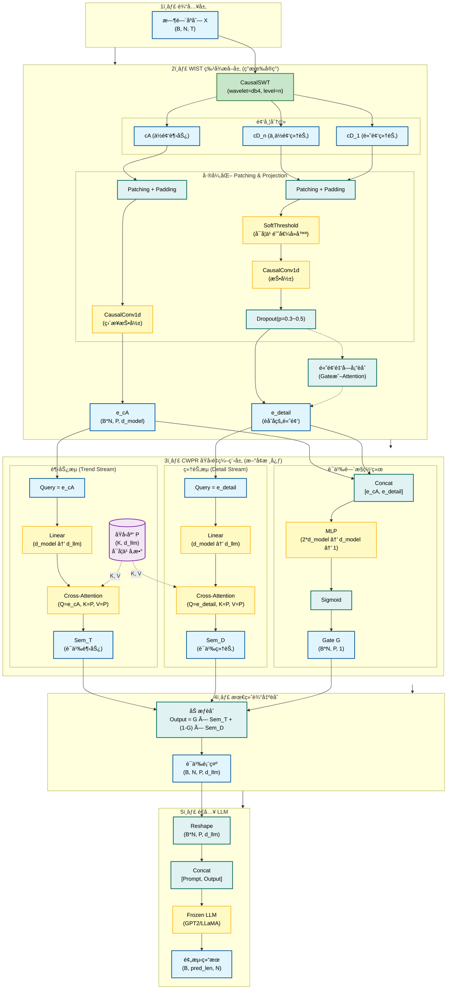
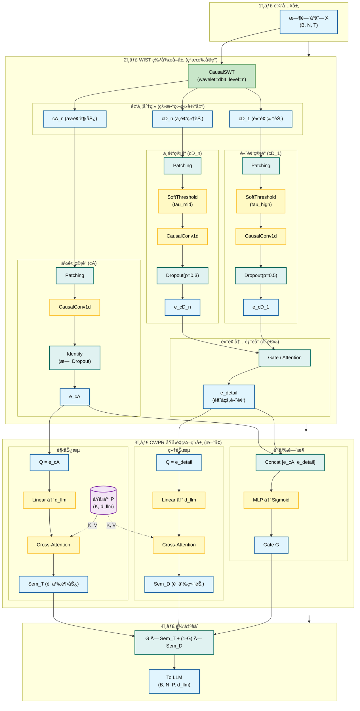
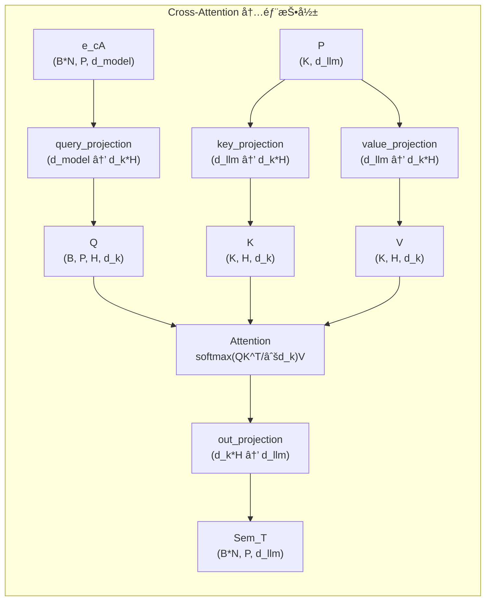
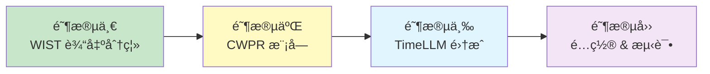
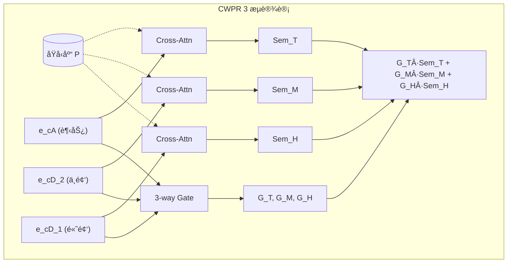
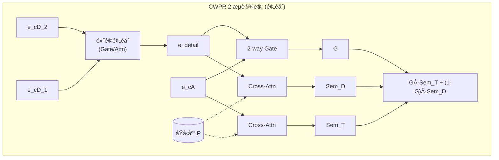
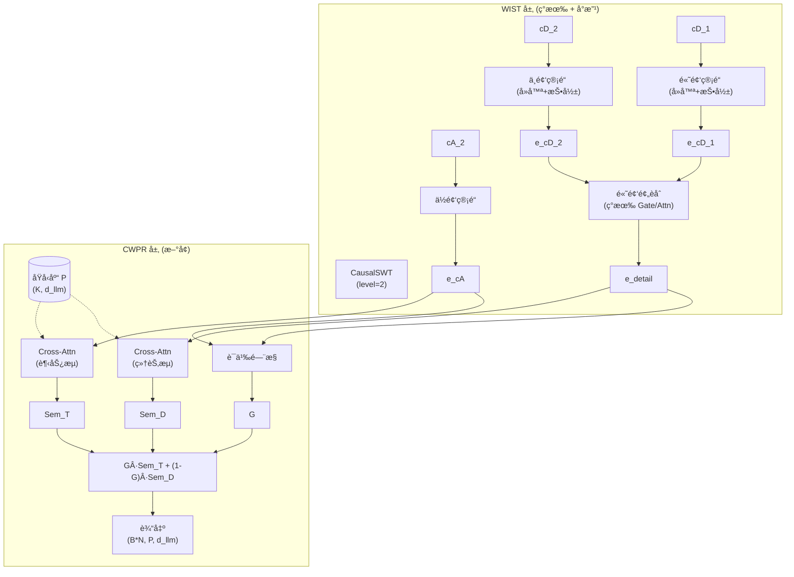

# Chat Conversation

Note: _This is purely the output of the chat conversation and does not contain any raw data, codebase snippets, etc. used to generate the output._

### User Input

graph TB
    %% æ ·å¼å®šä¹‰
    classDef tensor fill:#e1f5fe,stroke:#01579b,stroke-width:2px,color:#000;
    classDef module fill:#fff9c4,stroke:#fbc02d,stroke-width:2px,color:#000;
    classDef param fill:#f3e5f5,stroke:#7b1fa2,stroke-width:2px,color:#000;
    classDef op fill:#e0f2f1,stroke:#00695c,stroke-width:2px,color:#000;

    subgraph Input ["输入层"]
        X["时间åºåˆ— X (B, N, T)"]:::tensor
    end

    %% ================= 1. WIST 特å¾æå–层 (ä¿ç•™ä½ çš„å®ç°) =================
    subgraph WIST_Extraction ["Step 1: WIST 特å¾æå– (ä½ çš„å®ç°)"]
        direction TB
        
        SWT["CausalSWT (Global)"]:::module
        X --> SWT
        
        subgraph Bands ["频带分离"]
            LF_Band["ä½é¢‘ cA (Trend)"]:::tensor
            HF_Bands["高频 cD_mid, cD_high (Detail)"]:::tensor
        end
        SWT --> LF_Band
        SWT --> HF_Bands
        
        %% Patching & Projection
        subgraph Projections ["Patching & Embedding"]
            LF_Proj["Patching -> Conv1d -> e_cA"]:::module
            HF_Proj["Patching -> SoftThreshold -> Conv1d -> e_cD_all"]:::module
        end
        LF_Band --> LF_Proj
        HF_Bands --> HF_Proj
        
        %% 高频预èåˆ (å¯é€‰ï¼Œä¸ºäº†ç®€åŒ–åç»­åŒæµ)
        HF_PreFuse["高频内部èåˆ (WIST_GATE_HF)<br/>Merge mid/high -> e_detail"]:::op
        HF_Proj --> HF_PreFuse
    end

    %% ================= 2. CWPR åŸå‹é‡ç¼–程层 (æ–°å¢/替æ¢éƒ¨åˆ†) =================
    subgraph CWPR_Reprogramming ["Step 2: CWPR åŸå‹é‡ç¼–程 (语义映射)"]
        
        PrototypeBank[("åŸå‹åº“ P (K, d_llm)")]:::param
        
        %% Trend Stream
        subgraph Stream_Trend ["è¶‹åŠ¿æµ (Trend Stream)"]
            Q_Trend["Q = e_cA"]:::tensor
            Attn_Trend["Cross-Attention<br/>(Q=e_cA, K=P, V=P)"]:::module
            Sem_Trend["语义趋势 (Sem_T)"]:::tensor
            
            LF_Proj --> Q_Trend
            Q_Trend --> Attn_Trend
            PrototypeBank -.-> Attn_Trend
            Attn_Trend --> Sem_Trend
        end
        
        %% Detail Stream
        subgraph Stream_Detail ["ç»†èŠ‚æµ (Detail Stream)"]
            Q_Detail["Q = e_detail"]:::tensor
            Attn_Detail["Cross-Attention<br/>(Q=e_detail, K=P, V=P)"]:::module
            Sem_Detail["语义细节 (Sem_D)"]:::tensor
            
            HF_PreFuse --> Q_Detail
            Q_Detail --> Attn_Detail
            PrototypeBank -.-> Attn_Detail
            Attn_Detail --> Sem_Detail
        end
        
        %% é—¨æ§ç½‘络 (å¤ç”¨ä½ çš„ WIST é—¨æ§æ€æƒ³ï¼Œä½†ä½œç”¨äºè¯­ä¹‰å±‚)
        subgraph Semantic_Gating ["语义门æ§"]
            Concat_Feats["Concat [e_cA, e_detail]"]:::op
            Gate_Net["MLP -> Sigmoid (Gate G)"]:::module
            
            LF_Proj --> Concat_Feats
            HF_PreFuse --> Concat_Feats
            Concat_Feats --> Gate_Net
        end
        
    end

    %% ================= 3. 输出èåˆ =================
    subgraph Final_Fusion ["Step 3: 最终输出"]
        WeightedSum["Output = G * Sem_T + (1-G) * Sem_D"]:::op
        Final_Out["To LLM (B, N, Patches, d_llm)"]:::tensor
        
        Sem_Trend --> WeightedSum
        Sem_Detail --> WeightedSum
        Gate_Net --> WeightedSum
        WeightedSum --> Final_Out
    end

    %% è¿æ¥
    WIST_Extraction --> CWPR_Reprogramming
    CWPR_Reprogramming --> Final_Fusion


@[layers] @[models/TimeLLM.py] 如æœå®ç°ä¸Šé¢æˆ‘给出的æ¶æ„图，请你分æä»æ•°æ®è¾“入层，patching embedding层（使用WIST分解），é‡ç¼–程层的新æ¶æ„应该是什么样å­ï¼Œç»™å‡ºmermaid图

### Planner Response

我æ¥åˆ†æç°æœ‰ä»£ç å¹¶ç†è§£æ‚¨æ出的æ¶æ„设计。首先让我查看相关文件。

*Listed directory [layers](file:///d:/Project/github/CAST/layers) *

*Analyzed [TimeLLM.py](file:///d:/Project/github/CAST/models/TimeLLM.py) *

### Planner Response

让我进一步查看关键文件的具体å®ç°ï¼š

*Viewed [CausalWavelet.py](file:///d:/Project/github/CAST/layers/CausalWavelet.py) *

*Viewed [Embed.py](file:///d:/Project/github/CAST/layers/Embed.py) *

*Viewed [TimeLLM.py](file:///d:/Project/github/CAST/models/TimeLLM.py) *

### Planner Response

让我继续查看 Embed.py 中的 WISTPatchEmbedding å®ç°ï¼š

*Viewed [Embed.py](file:///d:/Project/github/CAST/layers/Embed.py) *

### Planner Response

ç°åœ¨æˆ‘å·²ç»å…¨é¢ç†è§£äº†ç°æœ‰ä»£ç ç»“æ„和您æ出的æ¶æ„图。让我为您分æ并给出新æ¶æ„çš„ **Mermaid 图**。

---

## 📊 æ–°æ¶æ„分æ

æ ¹æ®æ‚¨æ供的æ¶æ„图，核心改进点如下：

1. **WIST 特å¾æå–层（ä¿ç•™ç°æœ‰å®ç°ï¼‰**
   - [CausalSWT](cci:2://file:///d:/Project/github/CAST/layers/CausalWavelet.py:106:0-245:21) 全局因æœå°æ³¢åˆ†è§£
   - 频带分离：ä½é¢‘ `cA` + 高频 `cD_mid`, `cD_high`
   - 差异化 Patching & Projection

2. **CWPR åŸå‹é‡ç¼–程层（新å¢æ ¸å¿ƒæ¨¡å—）**
   - **åŸå‹åº“ P**：å¯å­¦ä¹ çš„åŸå‹å‘é‡é›† [(K, d_llm)](cci:2://file:///d:/Project/github/CAST/models/TimeLLM.py:31:0-542:19)
   - **趋势æµ**：`Q=e_cA`, Cross-Attention 映射到语义空间
   - **细节æµ**：`Q=e_detail`, Cross-Attention 映射到语义空间
   - **语义门æ§**：基äºåŸå§‹ç‰¹å¾ `[e_cA, e_detail]` 计算门æ§æƒé‡

3. **最终输出èåˆ**
   - é—¨æ§åŠ æƒæ±‚和：`G * Sem_T + (1-G) * Sem_D`
   - 输出é€å…¥ LLM

---

## 🧩 æ–°æ¶æ„ Mermaid 图



---

## 🔑 ä¸ç°æœ‰æ¶æ„的对比

| 组件 | ç°æœ‰å®ç° | æ–°æ¶æ„ (CWPR) |
|------|----------|---------------|
| **Embedding 输出** | ç›´æ¥é—¨æ§èåˆ â†’ `d_model` | åŒæµ Cross-Attention → `d_llm` |
| **é‡ç¼–程层** | å•ä¸€ Cross-Attention (Q=patch, K=V=è¯è¡¨) | åŒæµ Cross-Attention (Q=频域特å¾, K=V=åŸå‹åº“) |
| **语义桥** | ä¾èµ–è¯è¡¨ Embedding çš„éšå¼æ˜ å°„ | å¯å­¦ä¹ åŸå‹åº“的显å¼è¯­ä¹‰é”šç‚¹ |
| **频域信æ¯ä¿ç•™** | èåˆå丢失显å¼é¢‘åŸŸç»“æ„ | 趋势/细节分æµï¼Œè¯­ä¹‰çº§ç‹¬ç«‹æ˜ å°„ |
| **é—¨æ§ä½ç½®** | Embedding 层内部 (特å¾çº§) | é‡ç¼–程层输出 (语义级) |

---

## 📌 关键设计决策

1. **åŸå‹åº“ P** 的设计：
   - å¤§å° `K` æ¨è 128~512，å¯ä½œä¸ºè¶…å‚数调优
   - åˆå§‹åŒ–æ–¹å¼ï¼šWord Embedding çš„èšç±»ä¸­å¿ƒ / éšæœºåˆå§‹åŒ– + 快速收敛

2. **Query 投影**：
   - 必须将 `d_model` 映射到 `d_llm`ï¼ˆé€‚é… LLM 维度）
   - æ¨è使用 `nn.Linear(d_model, d_llm)`

3. **语义门æ§çš„输入选择**：
   - 使用åŸå§‹ Embedding `[e_cA, e_detail]` 而é语义输出
   - åŸå› ï¼šé¿å… Cross-Attention çš„ä¿¡æ¯ç“¶é¢ˆå½±å“é—¨æ§åˆ¤æ–­

这个æ¶æ„å°† **WIST 的频域解耦** ä¸ **CWPR 的语义映射** 有机结åˆï¼Œå®ç°äº†ä»"æ—¶åºç‰¹å¾ç©ºé—´"到"LLM 语义空间"的显å¼ã€å¯è§£é‡Šçš„åŒæµæ¡¥æ¥ã€‚

### User Input

你的中ä½é¢‘和高频是èåˆåœ¨ä¸€èµ·ç„¶å进行的å»å™ªï¼Œæˆ‘åŸæ¥çš„是分开å»å™ªçš„，请你分æ

### Planner Response

您说得对ï¼æˆ‘仔细分æ了您ç°æœ‰çš„ [WISTPatchEmbedding](cci:2://file:///d:/Project/github/CAST/layers/Embed.py:823:0-1247:44) 代ç ï¼Œç¡®å®æ˜¯**æ¯ä¸ªé¢‘段独立å»å™ª**，而ä¸æ˜¯èåˆåå»å™ªã€‚让我更正分æ：

---

## 📊 ç°æœ‰å®ç°çš„准确æµç¨‹åˆ†æ

æ ¹æ® [_forward_pyramid](cci:1://file:///d:/Project/github/CAST/layers/Embed.py:1166:4-1247:44) 方法（第 1167-1248 行）：

```python
for i in range(self.num_bands):
    band = coeffs[:, :, :, i]  # æå–第 i 个频段
    
    # Patching
    patches = band.unfold(...)
    
    # ã€ç‹¬ç«‹å»å™ªã€‘对高频频段应用软阈值 (i > 0)
    if i > 0 and self.use_soft_threshold:
        patches = self.band_thresholds[i](patches)  # ↠æ¯ä¸ªé¢‘段å•ç‹¬å»å™ª
    
    # 投影
    e_band = embedding_layer(patches)
    
    # ã€ç‹¬ç«‹ Dropout】
    e_band = self.band_dropouts[i](e_band)  # ↠æ¯ä¸ªé¢‘段å•ç‹¬ Dropout
    
    band_embeddings.append(e_band)

# ã€æœ€åæ‰èåˆã€‘
e_fused = freq_attention(band_embeddings)  # 或 gate_layers
```

---

## 🔄 修正åçš„ Mermaid æ¶æ„图



---

## 📌 关键差异对比

| 处ç†ç¯èŠ‚ | 错误ç†è§£ | 正确å®ç° |
|---------|---------|---------|
| **å»å™ªä½ç½®** | èåˆå统一å»å™ª | **æ¯ä¸ªé«˜é¢‘频段独立å»å™ª** |
| **阈值å‚æ•°** | 共享一个 threshold | **æ¯ä¸ªé¢‘段独立阈值** `band_thresholds[i]` |
| **Dropout 强度** | 统一 Dropout | **线性æ’值**：中频 0.3 → 高频 0.5 |
| **ä½é¢‘处ç†** | 也åšå»å™ª | **ä½é¢‘ä¸åšå»å™ª/Dropout** (`Identity`) |
| **èåˆæ—¶æœº** | å»å™ªåç«‹å³èåˆ | **投影+Dropout åæ‰èåˆ** |

---

## 🔑 这样设计的åˆç†æ€§

1. **独立阈值学习**  
   æ¯ä¸ªé¢‘段的噪声特性ä¸åŒï¼Œ`cD_1` 包å«æ›´å¤šé«˜é¢‘噪声，需è¦æ›´å¤§çš„阈值过滤

2. **差异化 Dropout**  
   - `cD_1` æœ€æ˜“è¿‡æ‹Ÿåˆ â†’ p=0.5 强正则
   - `cD_n` 相对平稳 → p=0.3 中等正则
   - `cA` 是趋势核心 → ä¸åš Dropout

3. **ä¿ç•™é¢‘域细粒度**  
   独立处ç†åå†èåˆï¼Œå¯ä»¥è®©åç»­çš„é—¨æ§/注æ„力机制更精准地感知å„频段的信æ¯é‡

您的åŸå§‹å®ç°æ˜¯æ›´åˆç†çš„设计ï¼æˆ‘çš„æ¶æ„图已修正为准确å映这个"**ç‹¬ç«‹ç®¡é“ â†’ åèåˆ**"的结æ„。

### User Input

å¾®å°çš„优化建议（锦上添花）：
虽然æ¶æ„图已ç»æ¥è¿‘完ç¾ï¼Œä½†æˆ‘注æ„到一点细节å¯ä»¥å¾®è°ƒï¼Œä»¥å¢å¼ºå…¶è¡¨è¾¾çš„准确性：

Proj_T å’Œ Proj_D çš„ä½ç½®ï¼š

在图中，Linear -> d_llm 被放在了 Cross-Attention 之å‰ã€‚

å®é™…上： Cross-Attention çš„ Query (å³ e_cA/e_detail) 的维度通常需è¦å…ˆæŠ•å½±åˆ°ä¸ Key (Prototype) 相åŒçš„维度 d_llm (或者注æ„力机制内部的 d_model) æ‰èƒ½è¿›è¡Œè®¡ç®—。

确认： åªè¦ä½ çš„ e_cA å’Œ e_detail 在进入 Cross-Attention 之å‰å·²ç»é€šè¿‡ Linear å˜æ¢åˆ°äº†åˆé€‚的维度，目å‰çš„ç”»æ³•å°±æ˜¯å®Œå…¨æ­£ç¡®çš„ã€‚å¦‚æœ e_cA 还是 Conv1d 输出的维度，那么这里加个 Linear 是必须的。目å‰çš„画法逻辑上是通的。

请你客观分æ其他ai的建议

### Planner Response

## 🔠客观分æ该建议

这个建议æ出了一个**正确的技术观点**，但表述å¯ä»¥æ›´ç²¾ç¡®ã€‚让我é€ç‚¹åˆ†æ：

---

### ✅ 建议正确的部分

**核心观点正确**：Cross-Attention çš„ Query å’Œ Key ç¡®å®éœ€è¦åœ¨æ³¨æ„力计算维度上对é½ã€‚

å›é¡¾ Cross-Attention 的数学：
```
Attention(Q, K, V) = softmax(Q @ K^T / √d_k) @ V
```
- `Q @ K^T` è¦æ±‚ Q 的最å一维 = K 的最å一维（都是 `d_k`）
- 这是必须满足的维度约æŸ

---

### âš ï¸ å»ºè®®ä¸å¤Ÿç²¾ç¡®çš„部分

**"æŠ•å½±åˆ°ä¸ Key (Prototype) 相åŒçš„维度 d_llm"** 这个表述ä¸å¤Ÿå‡†ç¡®ã€‚

å‚考您ç°æœ‰çš„ [ReprogrammingLayer](cci:2://file:///d:/Project/github/CAST/models/TimeLLM.py:545:0-583:38) å®ç°ï¼ˆç¬¬ 546-584 行）：

```python
def __init__(self, d_model, n_heads, d_keys=None, d_llm=None, ...):
    d_keys = d_keys or (d_model // n_heads)
    
    # Q æ¥è‡ª d_model，投影到 d_keys * n_heads
    self.query_projection = nn.Linear(d_model, d_keys * n_heads)
    
    # K, V æ¥è‡ª d_llm，投影到 d_keys * n_heads
    self.key_projection = nn.Linear(d_llm, d_keys * n_heads)
    self.value_projection = nn.Linear(d_llm, d_keys * n_heads)
    
    # è¾“å‡ºä» d_keys * n_heads æŠ•å½±å› d_llm
    self.out_projection = nn.Linear(d_keys * n_heads, d_llm)
```

**关键点**：
| 维度 | å«ä¹‰ | å®é™…值 |
|-----|------|-------|
| `d_model` | WIST Embedding 输出维度 | 32 (configs.d_model) |
| `d_llm` | LLM 嵌入维度 | 768 (GPT2) / 4096 (LLaMA) |
| `d_keys * n_heads` | 注æ„力计算的内部维度 | d_ff = 128 (å…¸å‹) |

**正确的ç†è§£**：
1. Q ä» `d_model` → `d_keys * n_heads`
2. K, V ä» `d_llm` → `d_keys * n_heads`
3. è¾“å‡ºä» `d_keys * n_heads` → `d_llm`

所以 Q 投影的目标维度是 **`d_keys * n_heads`**（注æ„力内部维度），ä¸æ˜¯ `d_llm`。

---

### 📊 修正å的精确æ¶æ„



---

### 📌 结论

| 评估项 | 判定 |
|-------|-----|
| å»ºè®®æ–¹å‘ | ✅ 正确（Q/K 需è¦ç»´åº¦å¯¹é½ï¼‰ |
| 具体æè¿° | âš ï¸ ä¸å¤Ÿç²¾ç¡®ï¼ˆæŠ•å½±ç›®æ ‡æ˜¯ `d_k*H`，ä¸æ˜¯ `d_llm`） |
| 我åŸå›¾çš„画法 | ✅ 逻辑正确（需è¦æŠ•å½±ï¼‰ï¼Œä½†å¯æ›´ç²¾ç¡® |
| 建议的价值 | ✅ æ醒了维度对é½é—®é¢˜ï¼Œå€¼å¾—在å®ç°æ—¶æ³¨æ„ |

**更准确的表述应该是**：  
> `e_cA` (维度 `d_model`) 需è¦é€šè¿‡ `query_projection` 投影到注æ„力内部维度 `d_k * n_heads`ï¼Œä¸ Key 对é½ååš Attention，最终通过 `out_projection` 输出到 `d_llm`。

这个建议本身是有价值的技术æ醒，åªæ˜¯è¡¨è¿°å¯ä»¥æ›´ç²¾ç¡®ã€‚感谢您让我客观分æï¼

### User Input

针对上述分æ，设计的æ¶æ„图需è¦è°ƒæ•´å—

### Planner Response

## 📊 分æ结论：需è¦å¾®è°ƒ

基äºåˆšæ‰çš„分æ，æ¶æ„图应该åšä»¥ä¸‹**简化**调整：

---

### 🔧 调整åŸå› 

| 问题 | è¯´æ˜ |
|-----|------|
| `Proj_T`, `Proj_D` 画在外部 | 投影应该是 **Cross-Attention 内部** 的组æˆéƒ¨åˆ†ï¼Œä¸åº”å•ç‹¬ç”»å‡º |
| 抽象层次混乱 | è¦ä¹ˆç”»é«˜å±‚æ¶æ„（黑盒），è¦ä¹ˆç”»è¯¦ç»†è®¾è®¡ï¼ˆå…¨éƒ¨å±•å¼€ï¼‰ |

**å‚考ç°æœ‰ [ReprogrammingLayer](cci:2://file:///d:/Project/github/CAST/models/TimeLLM.py:545:0-583:38)**：它把 Q/K/V 投影å°è£…在内部，对外åªæš´éœ²è¾“入输出æ¥å£ã€‚

---

### ✅ 简化åçš„æ¶æ„图


---

### 📋 调整总结

| 调整项 | ä¹‹å‰ | 之å |
|-------|-----|------|
| `Proj_T`, `Proj_D` | å•ç‹¬ç”»åœ¨å¤–部 | **删除**（内化到 Cross-Attention） |
| Cross-Attention | åªæ ‡æ³¨å称 | 标注 **输入/输出维度** |
| 整体é£æ ¼ | æ··åˆå±‚次 | **统一为高层æ¶æ„图** |

这样æ¶æ„图更加**简æ´æ¸…æ™°**，符åˆè®¾è®¡æ–‡æ¡£çš„表达规范。Cross-Attention 的内部å®ç°ç»†èŠ‚（Q/K/V 投影）留给代ç å®ç°é˜¶æ®µå¤„ç†ã€‚

### User Input

 请你给出ç°åœ¨è¦å®ç°ä¸Šè¿°çš„æ¶æ„çš„å®ç°æ­¥éª¤

### Planner Response

## 📋 CWPR æ¶æ„å®ç°æ­¥éª¤

æ ¹æ®æœ€ç»ˆç¡®å®šçš„æ¶æ„，以下是分阶段的å®ç°æ­¥éª¤ï¼š

---

### 🔧 阶段一：修改 WIST 层输出

**目标**：让 [WISTPatchEmbedding](cci:2://file:///d:/Project/github/CAST/layers/Embed.py:823:0-1247:44) åŒæ—¶è¾“出 `e_cA` å’Œ `e_detail`（目å‰åªè¾“出èåˆå的结æœï¼‰

| 步骤 | 任务 | 文件 |
|-----|------|-----|
| 1.1 | 修改 [_forward_pyramid](cci:1://file:///d:/Project/github/CAST/layers/Embed.py:1166:4-1247:44) æ–¹æ³•ï¼Œè¿”å› [(e_cA, e_detail, n_vars)](cci:2://file:///d:/Project/github/CAST/models/TimeLLM.py:31:0-542:19) 三元组 | [layers/Embed.py](cci:7://file:///d:/Project/github/CAST/layers/Embed.py:0:0-0:0) |
| 1.2 | æ–°å¢ `forward_for_cwpr()` 方法，专门为 CWPR æ供分离输出 | [layers/Embed.py](cci:7://file:///d:/Project/github/CAST/layers/Embed.py:0:0-0:0) |
| 1.3 | ä¿æŒåŸæœ‰ [forward()](cci:1://file:///d:/Project/github/CAST/layers/Embed.py:770:4-772:30) 兼容性，内部调用新方法åèåˆ | [layers/Embed.py](cci:7://file:///d:/Project/github/CAST/layers/Embed.py:0:0-0:0) |

**输出å˜åŒ–**：
```
åŸï¼š(e_fused, n_vars)  →  形状 (B*N, P, d_model)
新：(e_cA, e_detail, n_vars)  →  两个 (B*N, P, d_model)
```

---

### 🔧 阶段二：å®ç° CWPR 模å—

**目标**：创建 `CWPRReprogrammingLayer` 类

| 步骤 | 任务 | è¯´æ˜ |
|-----|------|------|
| 2.1 | 创建新文件 `layers/CWPR.py` | 存放 CWPR ç›¸å…³æ¨¡å— |
| 2.2 | å®ç° `PrototypeBank` ç±» | å¯å­¦ä¹ åŸå‹åº“ [(K, d_llm)](cci:2://file:///d:/Project/github/CAST/models/TimeLLM.py:31:0-542:19) |
| 2.3 | å®ç° `DualStreamCrossAttention` ç±» | åŒæµ Cross-Attention (è¶‹åŠ¿æµ + 细节æµ) |
| 2.4 | å®ç° `SemanticGate` ç±» | 语义门æ§ç½‘络 |
| 2.5 | å®ç° `CWPRReprogrammingLayer` ç±» | 组åˆä¸Šè¿°ç»„ä»¶çš„ä¸»æ¨¡å— |

**模å—æ¥å£è®¾è®¡**：
```
CWPRReprogrammingLayer:
  输入: e_cA (B*N, P, d_model), e_detail (B*N, P, d_model)
  输出: semantic_out (B*N, P, d_llm)
```

---

### 🔧 阶段三：集æˆåˆ° TimeLLM

**目标**：在 [Model](cci:2://file:///d:/Project/github/CAST/models/TimeLLM.py:31:0-542:19) 类中替æ¢åŸæœ‰ [ReprogrammingLayer](cci:2://file:///d:/Project/github/CAST/models/TimeLLM.py:545:0-583:38)

| 步骤 | 任务 | 文件 |
|-----|------|-----|
| 3.1 | æ–°å¢é…ç½®å‚æ•° `use_cwpr` | [models/TimeLLM.py](cci:7://file:///d:/Project/github/CAST/models/TimeLLM.py:0:0-0:0) |
| 3.2 | æ¡ä»¶åˆå§‹åŒ–：CWPR vs åŸç‰ˆ ReprogrammingLayer | [models/TimeLLM.py](cci:7://file:///d:/Project/github/CAST/models/TimeLLM.py:0:0-0:0) |
| 3.3 | 修改 [forecast()](cci:1://file:///d:/Project/github/CAST/models/TimeLLM.py:294:4-398:26) 方法，根æ®æ¨¡å¼è°ƒç”¨ä¸åŒé€»è¾‘ | [models/TimeLLM.py](cci:7://file:///d:/Project/github/CAST/models/TimeLLM.py:0:0-0:0) |
| 3.4 | ç¡®ä¿ä¸ç°æœ‰ [FlattenHead](cci:2://file:///d:/Project/github/CAST/models/TimeLLM.py:16:0-28:16) / `TriBandDecoupledHead` 兼容 | [models/TimeLLM.py](cci:7://file:///d:/Project/github/CAST/models/TimeLLM.py:0:0-0:0) |

---

### 🔧 阶段四：é…ç½®ä¸è®­ç»ƒæ”¯æŒ

| 步骤 | 任务 | 文件 |
|-----|------|-----|
| 4.1 | æ–°å¢ CWPR 相关超å‚数到 `args` | `run.py` / [config](cci:1://file:///d:/Project/github/CAST/layers/Embed.py:375:4-385:23) |
| 4.2 | 支æŒåŸå‹åº“å¤§å° Kã€åˆå§‹åŒ–æ–¹å¼ç­‰é…ç½® | - |
| 4.3 | 添加 CWPR ç›¸å…³æ—¥å¿—æ‰“å° | - |

---

### 📊 关键超å‚æ•°

| å‚æ•°å | å«ä¹‰ | 建议默认值 |
|-------|------|-----------|
| `use_cwpr` | 是å¦å¯ç”¨ CWPR é‡ç¼–程 | `0` (关闭) |
| `cwpr_num_prototypes` | åŸå‹åº“å¤§å° K | `256` |
| `cwpr_n_heads` | Cross-Attention 头数 | `8` |
| `cwpr_dropout` | Attention dropout | `0.1` |
| `cwpr_proto_init` | åŸå‹åˆå§‹åŒ–æ–¹å¼ | `'random'` / `'word_embed'` |

---

### 📠文件结æ„å˜åŒ–

```
layers/
├── Embed.py           # 修改：WISTPatchEmbedding æ–°å¢åˆ†ç¦»è¾“出
├── CWPR.py            # æ–°å¢ï¼šCWPR 模å—
│   ├── PrototypeBank
│   ├── DualStreamCrossAttention
│   ├── SemanticGate
│   └── CWPRReprogrammingLayer
├── CausalWavelet.py   # ä¸å˜
└── ...

models/
└── TimeLLM.py         # ä¿®æ”¹ï¼šé›†æˆ CWPR
```

---

### â±ï¸ 建议开å‘顺åº



---

需è¦æˆ‘开始**执行具体æŸä¸ªé˜¶æ®µçš„å®ç°**å—？如æœæ˜¯ï¼Œè¯·å‘Šè¯‰æˆ‘ä»å“ªä¸ªé˜¶æ®µå¼€å§‹ã€‚

### User Input

有个问题，ç°åœ¨æˆ‘ä¸æ˜¯è¿›è¡Œçš„2级haar分解å—，应该有三个分支把

### Planner Response

您说得对ï¼2 级å°æ³¢åˆ†è§£ç¡®å®äº§ç”Ÿ **3 个频带**：

| 频带 | è¯´æ˜ | 频ç‡ç‰¹æ€§ |
|-----|------|---------|
| `cA_2` | ä½é¢‘è¿‘ä¼¼ | 趋势 (Trend) |
| `cD_2` | 第 2 级细节 | 中频 (Mid-frequency) |
| `cD_1` | 第 1 级细节 | 高频 (High-frequency) |

---

## 🤔 两ç§è®¾è®¡æ–¹æ¡ˆ

### 方案 A：3 æµç‹¬ç«‹è®¾è®¡

æ¯ä¸ªé¢‘带独立进入 CWPR，3 æ¡ Cross-Attention 并行：



**优点**：æ¯ä¸ªé¢‘带独立映射，ä¿ç•™æœ€å¤§ä¿¡æ¯é‡  
**缺点**：å‚æ•°é‡ Ã—1.5，计算é‡å¢åŠ 

---

### 方案 B：2 æµè®¾è®¡ï¼ˆé¢„èåˆé«˜é¢‘）

å…ˆèåˆ `cD_2 + cD_1 → e_detail`，å†è¿›å…¥ CWPR：



**优点**：å‚æ•°é‡å°ï¼Œä¸æ‚¨ç°æœ‰ WIST 金字塔èåˆå…¼å®¹  
**缺点**：高频信æ¯åœ¨ CWPR å‰å·²èåˆï¼Œå¯èƒ½ä¸¢å¤±éƒ¨åˆ†åŒºåˆ†åº¦

---

## 📊 对比分æ

| 维度 | 方案 A (3 æµ) | 方案 B (2 æµé¢„èåˆ) |
|-----|--------------|-------------------|
| Cross-Attention æ•°é‡ | 3 个 | 2 个 |
| å‚æ•°é‡ | 较大 | è¾ƒå° |
| 计算å¤æ‚度 | O(3×P×K) | O(2×P×K) |
| 频域信æ¯ä¿ç•™ | 最大化 | 中高频信æ¯æ··åˆ |
| é—¨æ§å¤æ‚度 | 3-way (Softmax) | 2-way (Sigmoid) |
| ä¸ç°æœ‰ä»£ç å…¼å®¹æ€§ | 需新å¢é€»è¾‘ | å¤ç”¨ç°æœ‰é‡‘å­—å¡”èåˆ |

---

## 🯠建议

**如æœè¿½æ±‚最大频域区分度**：  
选择 **方案 A (3 æµ)**，让æ¯ä¸ªé¢‘带在语义空间中独立映射

**如æœè¿½æ±‚å®ç°ç®€æ´æ€§**：  
选择 **方案 B (2 æµ)**，å¤ç”¨ç°æœ‰ [WISTPatchEmbedding](cci:2://file:///d:/Project/github/CAST/layers/Embed.py:950:0-1431:44) 的金字塔èåˆé€»è¾‘

---

您倾å‘äºå“ªç§æ–¹æ¡ˆï¼Ÿè¿™ä¼šå½±å“åç»­çš„æ¶æ„图和å®ç°æ­¥éª¤ã€‚

### User Input

方案 B

请你给出ç°åœ¨çš„å®ç°çš„步骤，ä¸å†™ä»£ç 

### Planner Response

## 📋 方案 B (2 æµé¢„èåˆ) å®ç°æ­¥éª¤

---

### 📊 最终æ¶æ„确认



---

### 🔧 阶段一：修改 WISTPatchEmbedding 输出

**目标**：输出分离的 `e_cA` 和 `e_detail`

| 步骤 | 任务 | è¯¦ç»†è¯´æ˜ |
|-----|------|---------|
| 1.1 | æ–°å¢æ–¹æ³• `forward_separated()` | è¿”å› [(e_cA, e_detail, n_vars)](cci:2://file:///d:/Project/github/CAST/models/TimeLLM.py:31:0-551:19) 三元组 |
| 1.2 | å¤ç”¨ [_forward_pyramid](cci:1://file:///d:/Project/github/CAST/layers/Embed.py:1342:4-1431:44) 逻辑 | 在èåˆå‰æ‹¦æˆªï¼Œè¿”å› `band_embeddings[0]` (e_cA) å’Œèåˆå的高频 |
| 1.3 | ä¿æŒåŸ [forward()](cci:1://file:///d:/Project/github/CAST/layers/Embed.py:897:4-899:30) ä¸å˜ | ç¡®ä¿ç°æœ‰è®­ç»ƒæµç¨‹ä¸å—å½±å“ |

**输入输出å˜åŒ–**：
```
forward():           (B, N, T) → (e_fused, n_vars)
forward_separated(): (B, N, T) → (e_cA, e_detail, n_vars)
```

---

### 🔧 阶段二：创建 CWPR 模å—

**新建文件**：`layers/CWPR.py`

| 步骤 | 组件 | èŒè´£ |
|-----|------|------|
| 2.1 | `PrototypeBank` | å¯å­¦ä¹ åŸå‹åº“，形状 [(K, d_llm)](cci:2://file:///d:/Project/github/CAST/models/TimeLLM.py:31:0-551:19) |
| 2.2 | `CWPRCrossAttention` | å•æµ Cross-Attention（å¤ç”¨ç°æœ‰ ReprogrammingLayer 结æ„） |
| 2.3 | `SemanticGate` | åŸºäº `[e_cA, e_detail]` 计算门æ§æƒé‡ G |
| 2.4 | `CWPRReprogrammingLayer` | 主模å—，组åˆä¸Šè¿°ç»„件 |

**模å—æ¥å£**：
```
CWPRReprogrammingLayer:
  __init__(d_model, d_llm, n_heads, num_prototypes, dropout)
  forward(e_cA, e_detail) → semantic_out (B*N, P, d_llm)
```

---

### 🔧 阶段三：集æˆåˆ° TimeLLM

**修改文件**：[models/TimeLLM.py](cci:7://file:///d:/Project/github/CAST/models/TimeLLM.py:0:0-0:0)

| 步骤 | 任务 | è¯¦ç»†è¯´æ˜ |
|-----|------|---------|
| 3.1 | æ–°å¢é…ç½® `use_cwpr` | æ§åˆ¶æ˜¯å¦å¯ç”¨ CWPR |
| 3.2 | æ¡ä»¶åˆå§‹åŒ– | `use_cwpr=1` 时创建 `CWPRReprogrammingLayer`，å¦åˆ™ç”¨åŸç‰ˆ |
| 3.3 | 修改 [forecast()](cci:1://file:///d:/Project/github/CAST/models/TimeLLM.py:294:4-398:26) | CWPR 模å¼è°ƒç”¨ `patch_embedding.forward_separated()` |
| 3.4 | ç¡®ä¿è¾“出维度一致 | 两ç§æ¨¡å¼éƒ½è¾“出 [(B*N, P, d_llm)](cci:2://file:///d:/Project/github/CAST/models/TimeLLM.py:31:0-551:19)，åç»­æµç¨‹ä¸å˜ |

**forecast() æµç¨‹å˜åŒ–**：
```
åŸç‰ˆ:
  x → patch_embedding() → e_fused → reprogramming_layer() → llm

CWPR:
  x → patch_embedding.forward_separated() → (e_cA, e_detail)
    → cwpr_layer(e_cA, e_detail) → semantic_out → llm
```

---

### 🔧 阶段四：é…ç½®ä¸è¶…å‚æ•°

**修改文件**：`run.py` 或é…置模å—

| å‚æ•° | å«ä¹‰ | 默认值 |
|-----|------|-------|
| `use_cwpr` | å¯ç”¨ CWPR | `0` |
| `cwpr_num_prototypes` | åŸå‹åº“å¤§å° K | `256` |
| `cwpr_n_heads` | Attention 头数 | `8` |
| `cwpr_dropout` | Attention dropout | `0.1` |
| `cwpr_gate_bias_init` | é—¨æ§åç½®åˆå§‹åŒ– | `2.0` (åå‘趋势) |

---

### 📠文件å˜æ›´æ€»è§ˆ

| 文件 | æ“作 | å˜æ›´èŒƒå›´ |
|-----|------|---------|
| `layers/CWPR.py` | **新建** | 全部 |
| [layers/Embed.py](cci:7://file:///d:/Project/github/CAST/layers/Embed.py:0:0-0:0) | 修改 | æ–°å¢ `forward_separated()` 方法 |
| [models/TimeLLM.py](cci:7://file:///d:/Project/github/CAST/models/TimeLLM.py:0:0-0:0) | 修改 | [__init__](cci:1://file:///d:/Project/github/CAST/layers/Embed.py:338:4-367:44) + [forecast()](cci:1://file:///d:/Project/github/CAST/models/TimeLLM.py:294:4-398:26) |
| `run.py` | 修改 | æ–°å¢ CWPR 超å‚æ•° |

---

### â±ï¸ å¼€å‘顺åº

```
阶段一 (WIST 输出分离)
   ↓
阶段二 (CWPR 模å—)
   ↓
阶段三 (TimeLLM 集æˆ)
   ↓
阶段四 (é…ç½® & 测试)
```

**预估工作é‡**：
- 阶段一：~30 分钟
- 阶段二：~2 å°æ—¶
- 阶段三：~1 å°æ—¶
- 阶段四：~30 分钟

---

确认无误å，我å¯ä»¥å¼€å§‹æ‰§è¡Œå…·ä½“阶段的å®ç°ã€‚ä»å“ªä¸ªé˜¶æ®µå¼€å§‹ï¼Ÿ

### User Input

请你一步一步开始å®æ–½

*Edited relevant file*

*Edited relevant file*

### User Input

请你开始å®æ–½

*Edited relevant file*

### Planner Response

ç°åœ¨è®©æˆ‘在 [WISTPatchEmbedding](cci:2://file:///d:/Project/github/CAST/layers/Embed.py:950:0-1431:44) 类中添加 `forward_separated()` 方法：

*Viewed [Embed.py](file:///d:/Project/github/CAST/layers/Embed.py) *

*Viewed [Embed.py](file:///d:/Project/github/CAST/layers/Embed.py) *

*Viewed [Embed.py](file:///d:/Project/github/CAST/layers/Embed.py) *

*Viewed [Embed.py](file:///d:/Project/github/CAST/layers/Embed.py) *

### Planner Response

ç°åœ¨æˆ‘æ¥æŸ¥çœ‹ [_forward_pyramid](cci:1://file:///d:/Project/github/CAST/layers/Embed.py:1342:4-1431:44) 方法的结尾ä½ç½®ï¼Œä»¥ä¾¿åœ¨æ­£ç¡®çš„ä½ç½®æ·»åŠ æ–°æ–¹æ³•ï¼š

*Viewed [Embed.py](file:///d:/Project/github/CAST/layers/Embed.py) *

### Planner Response

ç°åœ¨æˆ‘需è¦åœ¨æ–‡ä»¶æœ«å°¾ï¼ˆç¬¬ 1433 行之å）添加 `forward_separated()` 方法。让我在 [WISTPatchEmbedding](cci:2://file:///d:/Project/github/CAST/layers/Embed.py:950:0-1431:44) 类中添加这个新方法：

*Edited relevant file*

### Planner Response

阶段一完æˆã€‚ç°åœ¨æ›´æ–°ä»»åŠ¡çŠ¶æ€å¹¶å¼€å§‹é˜¶æ®µäºŒï¼šåˆ›å»º CWPR 模å—。

*Edited relevant file*

*Edited relevant file*

### Planner Response

阶段二完æˆã€‚ç°åœ¨æ›´æ–°ä»»åŠ¡çŠ¶æ€å¹¶å¼€å§‹é˜¶æ®µä¸‰ï¼šé›†æˆåˆ° TimeLLM。

*Edited relevant file*

### Planner Response

ç°åœ¨ä¿®æ”¹ TimeLLM.py，添加 CWPR 支æŒã€‚首先查看需è¦ä¿®æ”¹çš„ä½ç½®ï¼š

*Viewed [TimeLLM.py](file:///d:/Project/github/CAST/models/TimeLLM.py) *

*Viewed [TimeLLM.py](file:///d:/Project/github/CAST/models/TimeLLM.py) *

### Planner Response

ç°åœ¨æˆ‘需è¦ä¿®æ”¹ TimeLLM.py。让我查看更多相关代ç ï¼š

*Viewed [TimeLLM.py](file:///d:/Project/github/CAST/models/TimeLLM.py) *

*Viewed [TimeLLM.py](file:///d:/Project/github/CAST/models/TimeLLM.py) *

### Planner Response

ç°åœ¨æˆ‘开始修改 TimeLLM.py。需è¦åœ¨ä¸‰ä¸ªåœ°æ–¹ä¿®æ”¹ï¼š

1. 添加 import
2. 添加 CWPR é…置和åˆå§‹åŒ–
3. 修改 forecast 方法

*Edited relevant file*

### Planner Response

ç°åœ¨æˆ‘需è¦ä¿®æ”¹ [forecast()](cci:1://file:///d:/Project/github/CAST/models/TimeLLM.py:294:4-398:26) 方法æ¥æ”¯æŒ CWPR 模å¼ã€‚让我查看需è¦ä¿®æ”¹çš„具体ä½ç½®ï¼š

*Viewed [TimeLLM.py](file:///d:/Project/github/CAST/models/TimeLLM.py) *

*Edited relevant file*

### Planner Response

阶段三基本完æˆã€‚ç°åœ¨è¿›å…¥é˜¶æ®µå››ï¼šæ·»åŠ é…ç½®å‚数并进行验è¯ã€‚

*Edited relevant file*

*User accepted the command `cd d:\Project\github\CAST && python -c "from layers.CWPR import CWPRReprogrammingLayer; print('CWPR module imported successfully')"`*

### Planner Response

命令因 PowerShell 问题失败。让我用ä¸åŒçš„æ–¹å¼è¿è¡Œæµ‹è¯•ï¼š

*User accepted the command `python -c "from layers.CWPR import CWPRReprogrammingLayer; print('CWPR module imported successfully')"`*

### Planner Response

看起æ¥å½“å‰ç¯å¢ƒæ²¡æœ‰å®‰è£… torch。这是一个ç¯å¢ƒé—®é¢˜ï¼Œä¸æ˜¯ä»£ç é—®é¢˜ã€‚让我进行语法检查：

*User accepted the command `python -m py_compile layers/CWPR.py`*