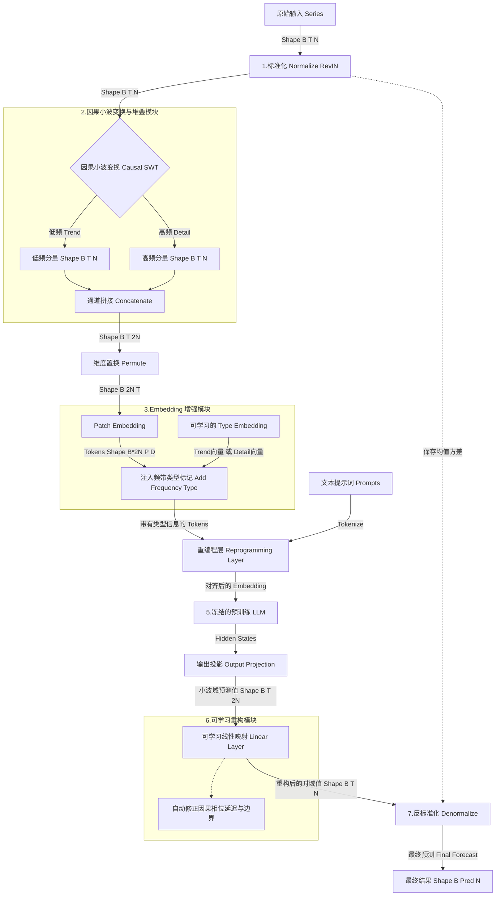

```mermaid
graph TD
    %% --- 样式定义 ---

    %% --- 输入阶段 ---
    Input[原始输入 Series] -->|Shape B T N| Norm
    class Input data;

    %% 1. 标准化
    Norm[1.标准化 Normalize RevIN] -->|Shape B T N| Wavelet
    Norm -.->|保存均值方差| DeNorm
    class Norm,DeNorm module;

    %% 2. 小波分解与堆叠 (关键修改点)
    subgraph Wavelet_Block [2.因果小波变换与堆叠模块]
        direction TB
        Wavelet{因果小波变换 Causal SWT}
        Wavelet -->|低频 Trend| Approx
        Wavelet -->|高频 Detail| Detail
        Approx[低频分量 Shape B T N]
        Detail[高频分量 Shape B T N]
        
        Approx --> Concat
        Detail --> Concat
        Concat[通道拼接 Concatenate]
    end
    class Wavelet,Concat newModule;
    class Approx,Detail data;

    %% 3. Patching 与 Embedding
    Concat -->|Shape B T 2N| Permute[维度置换 Permute]
    Permute -->|Shape B 2N T| PatchEmb
    class Permute module;

    subgraph Embedding_Block [3.Embedding 增强模块]
        direction TB
        PatchEmb[Patch Embedding]
        PatchEmb -->|Tokens Shape B*2N P D| AddType
        
        TypeEmb[可学习的 Type Embedding]
        TypeEmb -->|Trend向量 或 Detail向量| AddType
        
        AddType[注入频带类型标记 Add Frequency Type]
    end
    class PatchEmb,AddType module;
    class TypeEmb newModule;

    %% --- LLM 处理阶段 ---
    AddType -->|带有类型信息的 Tokens| Repro[重编程层 Reprogramming Layer]
    class Repro module;

    Text[文本提示词 Prompts] -->|Tokenize| Repro
    class Text data;

    Repro -->|对齐后的 Embedding| LLM[5.冻结的预训练 LLM]
    class LLM llm;

    LLM -->|Hidden States| OutProj[输出投影 Output Projection]
    class OutProj module;

    %% --- 输出与重构阶段 (方案一) ---
    OutProj -->|小波域预测值 Shape B T 2N| LearnableRec
    
    subgraph Reconstruction [6.可学习重构模块]
        direction TB
        LearnableRec[可学习线性映射 Linear Layer]
        Note[自动修正因果相位延迟与边界]
        
        LearnableRec -.-> Note
    end
    class LearnableRec newModule;
    class Note data;

    %% 7. 反标准化
    LearnableRec -->|重构后的时域值 Shape B T N| DeNorm
    
    DeNorm[7.反标准化 Denormalize]
    DeNorm -->|最终预测 Final Forecast| Final[最终结果 Shape B Pred N]
    class Final data;

```