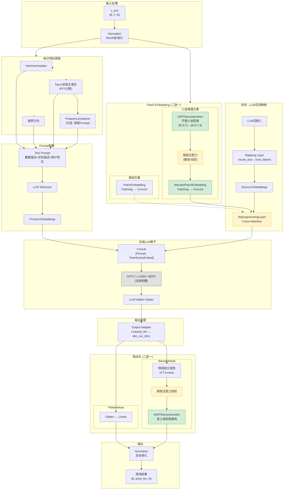
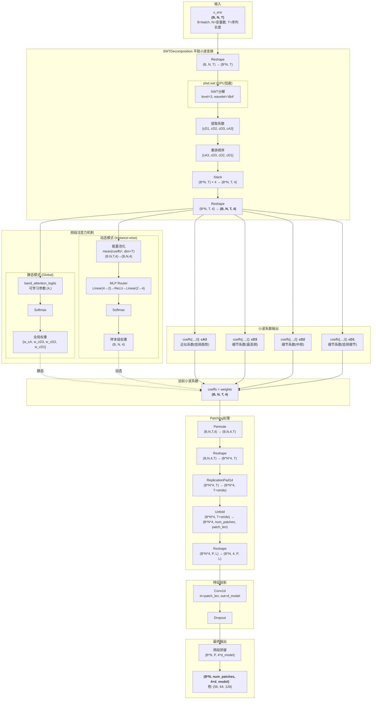
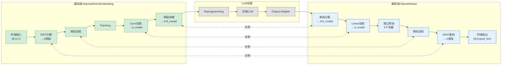

让我先阅读这些文件来理解模型架构。

继续读取剩余的关键文件和TimeLLM.py的后半部分。

根据代码分析，SWT-Time 模型架构如下：

## 核心组件说明

| 模块 | 功能 | 位置 |
|------|------|------|
| **Normalize** | RevIN可逆标准化 | [StandardNorm.py](cci:7://file:///home/dmx_MT/LZF/project/SWT-Time/layers/StandardNorm.py:0:0-0:0) |
| **WaveletPatchEmbedding** | SWT分解 + 频段注意力 + Patching | [WaveletEmbed.py](cci:7://file:///home/dmx_MT/LZF/project/SWT-Time/layers/WaveletEmbed.py:0:0-0:0) |
| **SWTDecomposition** | 平稳小波变换(GPU加速) | [WaveletEmbed.py](cci:7://file:///home/dmx_MT/LZF/project/SWT-Time/layers/WaveletEmbed.py:0:0-0:0) |
| **DynamicBandAttention** | 样本级动态频段权重 | [WaveletEmbed.py](cci:7://file:///home/dmx_MT/LZF/project/SWT-Time/layers/WaveletEmbed.py:0:0-0:0) |
| **ReprogrammingLayer** | Cross-Attention重编程 | [TimeLLM.py](cci:7://file:///home/dmx_MT/LZF/project/SWT-Time/models/TimeLLM.py:0:0-0:0) |
| **WaveletHead** | 小波系数预测 + ISWT重构 | [TimeLLM.py](cci:7://file:///home/dmx_MT/LZF/project/SWT-Time/models/TimeLLM.py:0:0-0:0) |
| **ISWTReconstruction** | 逆小波变换重构 | [WaveletEmbed.py](cci:7://file:///home/dmx_MT/LZF/project/SWT-Time/layers/WaveletEmbed.py:0:0-0:0) |
| **FrequencyAnalyzer** | 频域特征分析(Prompt增强) | [TimeLLM.py](cci:7://file:///home/dmx_MT/LZF/project/SWT-Time/models/TimeLLM.py:0:0-0:0) |

## 架构亮点

- **对称小波域设计**：编码端SWT ↔ 解码端ISWT
- **频段注意力机制**：可学习的频段重要性权重
- **冻结LLM骨干**：只训练适配层，高效微调
- **边界优化**：历史系数拼接消除ISWT边界伪影

## 维度变换详细流程

| 步骤 | 操作 | 维度变化 | 说明 |
|------|------|----------|------|
| 1 | 输入 | `(B, N, T)` | B=8, N=7, T=512 |
| 2 | SWT分解 | `(B, N, T) → (B, N, T, 4)` | 4个频段：cA3, cD3, cD2, cD1 |
| 3 | 频段加权 | `(B, N, T, 4) × (4,)` | 静态或动态权重 |
| 4 | Permute | `(B, N, T, 4) → (B, N, 4, T)` | 调整频段维度位置 |
| 5 | Reshape | `(B*N*4, T)` | 8×7×4=224 |
| 6 | Padding | `(B*N*4, T+stride)` | 复制填充 |
| 7 | Unfold | `(B*N*4, P, L)` | P=num_patches, L=patch_len |
| 8 | Conv1d | `(B*N*4, P, d_model)` | 投影到d_model=32 |
| 9 | 频段拼接 | `(B*N, P, 4×d_model)` | 56, 64, 128 |

## 频段物理含义

| 频段 | 频率范围 | 物理意义 | 默认权重 |
|------|----------|----------|----------|
| **cA3** | 最低频 | 全局趋势、长周期模式 | 1.5 (最重要) |
| **cD3** | 最高频 | 高频噪声、快速波动 | 0.3 (抑制) |
| **cD2** | 中频 | 中期周期、季节性 | 1.0 |
| **cD1** | 中低频 | 短期波动细节 | 0.8 |

```mermaid
flowchart TB
    subgraph LLMOutput["LLM输出"]
        HiddenState["LLM Hidden States<br/><b>(B*N, seq_len, d_llm)</b><br/>d_llm=768(GPT2)/4096(LLAMA)"]
    end

    subgraph OutputAdapter["Output Adapter 输出适配器"]
        direction TB
        AdapterLinear["Linear(d_llm → dec_out_dim)<br/>768 → 128 (WaveletHead)<br/>768 → d_ff (FlattenHead)"]
        AdapterOut["<b>(B*N, seq_len, dec_out_dim)</b>"]
    end

    subgraph Reshape1["维度重组"]
        R1["Reshape<br/>(B*N, seq, dim) → (B, N, seq, dim)"]
        R2["Permute<br/>(B, N, seq, dim) → (B, N, dim, seq)"]
        R3["取最后patch_nums列<br/>(B, N, dim, patch_nums)"]
    end

    subgraph HeadChoice["输出头选择"]
        direction LR
        FH["FlattenHead<br/>直接时域映射"]
        WH["WaveletHead<br/>小波域对称解码"]
    end

    subgraph FlattenHead["FlattenHead 详细流程"]
        direction TB
        FH_Flatten["Flatten<br/>(B, N, d_ff, P) → (B, N, d_ff*P)"]
        FH_Linear["Linear(d_ff*P → pred_len)"]
        FH_Dropout["Dropout"]
        FH_Out["<b>(B, N, pred_len)</b>"]
    end

    subgraph WaveletHead["WaveletHead 详细流程"]
        direction TB
        
        subgraph Split["频段分离"]
            WH_Input["输入: (B, N, 4*d_model, P)<br/>例: (8, 7, 128, 64)"]
            WH_Split["Split(dim=2)<br/>按d_model=32分割"]
            Band0["Band0: cA3<br/>(B, N, 32, P)"]
            Band1["Band1: cD3<br/>(B, N, 32, P)"]
            Band2["Band2: cD2<br/>(B, N, 32, P)"]
            Band3["Band3: cD1<br/>(B, N, 32, P)"]
        end

        subgraph BandProj["频段独立投影"]
            Proj0["Linear(32*P → pred_len)<br/>cA3_pred"]
            Proj1["Linear(32*P → pred_len)<br/>cD3_pred"]
            Proj2["Linear(32*P → pred_len)<br/>cD2_pred"]
            Proj3["Linear(32*P → pred_len)<br/>cD1_pred"]
        end

        subgraph StackCoeffs["系数堆叠"]
            Stack["Stack(dim=-1)<br/>4×(B,N,pred_len) → (B,N,pred_len,4)"]
        end

        subgraph BandAttnDec["解码端频段注意力"]
            direction TB
            
            subgraph StaticDec["静态模式"]
                StaticLogits2["band_attention_logits<br/>可学习 (4,)"]
                StaticSoftmax2["Softmax → weights"]
            end
            
            subgraph DynamicDec["动态模式"]
                Energy2["能量池化<br/>(B,N,pred_len,4)→(B,N,4)"]
                MLP2["MLP Router"]
                DynWeights2["样本级权重<br/>(B, N, 4)"]
            end
            
            ApplyWeights["coeffs × weights<br/>(B, N, pred_len, 4)"]
        end

        subgraph Boundary["边界优化 (可选)"]
            HistCoeffs["历史小波系数<br/>history_coeffs<br/>(B, N, T, 4)"]
            HistSuffix["取尾部filter_len点<br/>(B, N, filter_len, 4)"]
            Concat["Concat<br/>[history | pred_coeffs]<br/>(B, N, filter_len+pred_len, 4)"]
        end

        subgraph ISWT["ISWTReconstruction 逆小波变换"]
            direction TB
            ISWT_Reshape["Reshape<br/>(B,N,L,4) → (B*N,L,4)"]
            ISWT_Reorder["重排系数顺序<br/>[cA,cD3,cD2,cD1]→[cD1,cD2,cD3,cA]"]
            ISWT_Op["ptwt.iswt<br/>GPU加速逆变换"]
            ISWT_Reshape2["Reshape<br/>(B*N, L) → (B, N, L)"]
            ISWT_Crop["裁剪边界部分<br/>(B, N, pred_len)"]
        end

        WH_Out["<b>(B, N, pred_len)</b>"]
    end

    subgraph PostProcess["后处理"]
        Permute2["Permute<br/>(B, N, pred_len) → (B, pred_len, N)"]
        Denorm["Normalize.denorm<br/>反标准化"]
    end

    subgraph FinalOutput["最终输出"]
        Pred["预测结果<br/><b>(B, pred_len, N)</b>"]
        OptCoeffs["可选: 预测小波系数<br/>(B, N, pred_len, 4)<br/>用于混合损失函数"]
    end

    %% 主数据流
    HiddenState --> AdapterLinear --> AdapterOut
    AdapterOut --> R1 --> R2 --> R3
    R3 --> HeadChoice
    
    %% FlattenHead分支
    HeadChoice -->|原始| FH
    FH --> FH_Flatten --> FH_Linear --> FH_Dropout --> FH_Out
    
    %% WaveletHead分支
    HeadChoice -->|小波| WH
    WH --> WH_Input --> WH_Split
    WH_Split --> Band0 & Band1 & Band2 & Band3
    
    Band0 --> Proj0
    Band1 --> Proj1
    Band2 --> Proj2
    Band3 --> Proj3
    
    Proj0 & Proj1 & Proj2 & Proj3 --> Stack
    
    Stack --> StaticLogits2 --> StaticSoftmax2 --> ApplyWeights
    Stack --> Energy2 --> MLP2 --> DynWeights2 --> ApplyWeights
    
    %% 边界优化
    HistCoeffs --> HistSuffix --> Concat
    ApplyWeights --> Concat
    
    %% ISWT
    Concat --> ISWT_Reshape --> ISWT_Reorder --> ISWT_Op --> ISWT_Reshape2 --> ISWT_Crop --> WH_Out
    
    %% 后处理
    FH_Out --> Permute2
    WH_Out --> Permute2
    Permute2 --> Denorm --> Pred
    
    ApplyWeights -.->|return_coeffs=True| OptCoeffs

    %% 样式

    
    class HiddenState llm
    class AdapterLinear,AdapterOut adapter
    class ISWT_Op,ISWT_Reorder,Stack,WH_Split wavelet
    class StaticLogits2,StaticSoftmax2,Energy2,MLP2,DynWeights2,ApplyWeights attn
    class Pred,OptCoeffs output
    class HistCoeffs,HistSuffix,Concat boundary
```

## 维度变换详细流程

| 步骤 | 操作 | 维度 | 说明 |
|------|------|------|------|
| **LLM输出** | Hidden States | `(B*N, seq, 768)` | GPT2的d_llm=768 |
| **Output Adapter** | Linear | `(B*N, seq, 128)` | 投影到4×d_model |
| **Reshape** | 维度重组 | `(B, N, 128, P)` | P=patch_nums |
| **Split** | 频段分离 | `4×(B, N, 32, P)` | 分回4个频段 |
| **投影** | 4个独立Linear | `4×(B, N, pred_len)` | 每频段独立预测 |
| **Stack** | 堆叠 | `(B, N, pred_len, 4)` | 组成小波系数 |
| **加权** | 频段注意力 | `(B, N, pred_len, 4)` | 加权调整 |
| **边界拼接** | Concat | `(B, N, L+pred_len, 4)` | L=filter_len |
| **ISWT** | 逆小波变换 | `(B, N, L+pred_len)` | 重构时域 |
| **裁剪** | 去除边界 | `(B, N, pred_len)` | 最终预测 |
| **Permute** | 维度调整 | `(B, pred_len, N)` | 标准输出格式 |

## 编码-解码对称性

## 边界优化原理

| 问题 | 原因 | 解决方案 |
|------|------|----------|
| **ISWT边界伪影** | 滤波器卷积在t=0处缺少历史上下文 | 拼接历史小波系数 |
| **历史系数来源** | 编码端SWT已分解过历史序列 | 复用`patch_embedding.swt(x_enc)` |
| **拼接长度** | 由小波滤波器长度决定 | `filter_len = wavelet.dec_len` (db4=8) |
| **裁剪输出** | 去除拼接的历史部分 | `pred = recon[:, :, filter_len:]` |